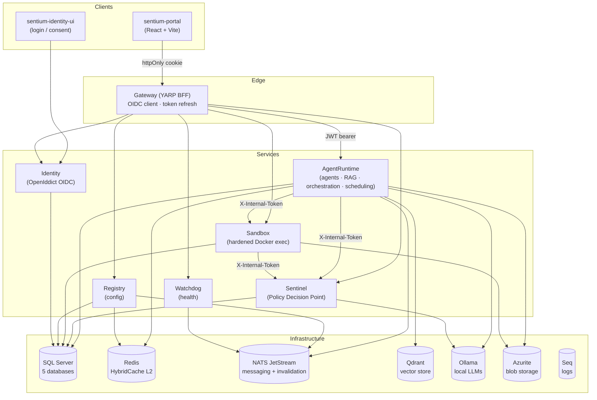

# Sentium

> A self-hostable, security-first platform for building, orchestrating and governing autonomous AI agents - powered entirely by local LLMs.

Sentium is a distributed multi-agent system built on **.NET 10 Aspire** and a **React** front-end. It lets you create AI agents, compose them into multi-agent workflows, give them tools (code execution, knowledge retrieval, scheduling, memory), and run the whole thing **on your own hardware** against **local models served by Ollama** - no data ever leaves the machine.

What sets Sentium apart is that every agent action is **mediated by a security control plane**: a dedicated Policy Decision Point (Sentinel) authorizes each tool call, a hardened Docker sandbox isolates all code execution, and a continuous self-improvement loop lets agents learn from past runs.

---

## Table of contents

- [Key features](#key-features)
- [Architecture](#architecture)
- [Technology stack](#technology-stack)
- [Getting started](#getting-started)
- [Running the tests](#running-the-tests)
- [Security model](#security-model)
- [Repository layout](#repository-layout)

---

## Key features

| Capability                               | Description                                                                                                                                                                               |
| ---------------------------------------- | ----------------------------------------------------------------------------------------------------------------------------------------------------------------------------------------- |
| **Conversational assistant**             | A streaming (SSE) chat assistant with tool use, live "thinking" traces, and human-in-the-loop approval for high-risk tool calls.                                                          |
| **Custom agents**                        | Define your own agents (name, persona/instructions, model) and manage them through the portal.                                                                                            |
| **Multi-agent orchestration**            | An Orchestrator agent decomposes a goal, assembles a squad of specialist agents, runs them sequentially, then a Validator agent reviews and triggers self-correcting re-runs.             |
| **Visual workflow builder**              | Compose reusable, ordered multi-agent workflows; run them on demand and replay every run from a persisted log.                                                                            |
| **Retrieval-Augmented Generation (RAG)** | Document ingestion (chunk → embed → store in Qdrant) across three vector collections: knowledge base, agent learnings, and user memories.                                                 |
| **Self-improvement loop**                | Agents capture reusable learnings that are automatically, semantically recalled and injected into future runs.                                                                            |
| **Isolated code execution**              | Agents can run Python / Node.js in a heavily hardened, network-disabled Docker sandbox; output artifacts are harvested to blob storage.                                                   |
| **Skills**                               | Built-in skills plus user-defined and uploaded-Markdown skills, unlocked on demand via a `load_skill` mechanism.                                                                          |
| **Autonomous scheduling**                | Agents (or users) can schedule recurring background jobs (Quartz cron) that execute code through the sandbox.                                                                             |
| **Workspaces & files**                   | Upload files into workspaces; they are asynchronously vectorized and made available to agents as context.                                                                                 |
| **Security control plane (Sentinel)**    | Every tool call passes a Policy Decision Point that performs rate-limiting and an LLM-based semantic-intent / prompt-injection check, with a fail-closed posture and full forensic audit. |
| **Health monitoring (Watchdog)**         | Continuous probing of all services and infrastructure, incident tracking, and a live status stream.                                                                                       |
| **Knowledge map**                        | An interactive, animated visualization of the vector store and semantic search traversal.                                                                                                 |
| **Centralized configuration (Registry)** | Per-user and global runtime settings with a two-tier cache and cluster-wide invalidation.                                                                                                 |
| **Identity & access**                    | Full OpenID Connect provider, cookie-based BFF authentication, a two-tier role model (Member / Sovereign), and per-user data isolation.                                                   |

---

## Architecture

Sentium is composed of seven ASP.NET Core micro-services, two React front-ends, and a set of backing infrastructure components - all orchestrated for local development by .NET Aspire.



### Services

| Service          | Responsibility                                                                                                                                                                                                           |
| ---------------- | ------------------------------------------------------------------------------------------------------------------------------------------------------------------------------------------------------------------------ |
| **Gateway**      | YARP-based Backend-for-Frontend. The single OIDC client; performs login/logout, transparent access-token refresh, and forwards requests to services as JWT-bearer calls. The browser only ever holds an httpOnly cookie. |
| **Identity**     | OpenIddict OIDC/OAuth2 authorization server. Authorization-code + PKCE, refresh tokens, client credentials. Owns users, roles, profile and registration.                                                                 |
| **AgentRuntime** | The core engine: agents, the streaming assistant, conversations, multi-agent orchestration, RAG/ingestion, learnings, skills, tools, workspaces, the knowledge map, and the Quartz scheduler.                            |
| **Sentinel**     | The Policy Decision Point (PDP). Every agent action is authorized via `POST /policy/evaluate` through a defence-in-depth policy stack, with forensic auditing and a fail-closed default.                                 |
| **Sandbox**      | Executes agent-submitted code in ephemeral, security-hardened Docker containers and harvests output artifacts to blob storage.                                                                                           |
| **Registry**     | Centralized, key-based runtime configuration with per-user and global scopes, EF Core JSON columns, two-tier caching and NATS-broadcast invalidation.                                                                    |
| **Watchdog**     | Periodically probes every service and infrastructure dependency, raises/resolves incidents, and streams live health over SSE.                                                                                            |

### Layering

Every service follows the same clean-architecture layering:

```
{Service}.Api            → HTTP controllers, validation, middleware
{Service}.Application    → use cases, orchestration, background workers
{Service}.Core           → domain entities, interfaces, DTOs
{Service}.Infrastructure → EF Core, external clients, persistence
```

### Cross-cutting patterns

- **Authentication** - the Gateway BFF is the only OIDC client; the front-end is fully cookie-based and never touches tokens.
- **Internal service-to-service** calls are authenticated with a pre-shared `X-Internal-Token` header (the `SystemCaller` policy), bypassing the user-facing PDP for trusted background work.
- **Per-user data isolation** - user-scoped tables carry a `UserId` and EF Core global query filters scope every query automatically; the `Sovereign` role and background tasks bypass the filter through an explicit accessor.
- **Async messaging** over NATS JetStream - workflow execution (`workflow.*`), real-time streaming (`stream.*`), and config invalidation (`registry.settings.invalidated`).
- **Caching** via HybridCache (L1 in-process + L2 Redis), invalidated cluster-wide over NATS.
- **Resilience** - a global Polly pipeline (retry + timeout + circuit-breaker) is applied to all HttpClients.

---

## Technology stack

**Backend**

- .NET 10 / C# · ASP.NET Core
- .NET Aspire (orchestration & service discovery)
- `Microsoft.Extensions.AI` + `Microsoft.Agents.AI` (agent framework) over **Ollama**
- Entity Framework Core (SQL Server)
- YARP (reverse proxy / BFF) · OpenIddict (OIDC server)
- NATS JetStream · Redis (HybridCache) · Quartz.NET (scheduling)
- Qdrant (vector store) · Docker.DotNet (sandbox)
- FluentValidation · Polly · Serilog → Seq

**Models (default, all local via Ollama)**

- Chat / reasoning: **Gemma** (`gemma4:e4b` by default; Qwen3 and others selectable)
- Embeddings: **nomic-embed-text** (768-dimensional)

**Frontend**

- React 19 + TypeScript + Vite (`sentium-portal`, `sentium-identity-ui`)
- TanStack Query v5 (server state) · Zustand v5 (client/streaming state)
- SCSS modules · pnpm

**Testing**

- xUnit v3 · Testcontainers · `Aspire.Hosting.Testing` (backend)
- Vitest (frontend) · Playwright (E2E)

---

## Getting started

### Prerequisites

- **.NET 10 SDK**
- **pnpm** (11.x)
- **Docker** - required for the code-execution sandbox, Testcontainers, and the Aspire-managed infrastructure containers
- An NVIDIA GPU is recommended for usable local-LLM latency (the AppHost requests GPU support for Ollama), but not strictly required

### Run the whole system

The Aspire AppHost is the single entry point. It starts all services, both front-ends, and every infrastructure dependency (SQL Server, Redis, NATS, Qdrant, Ollama, Seq, Azurite), and automatically pulls the default Ollama models on first run.

```bash
dotnet run --project src/aspire/Sentium.AppHost/Sentium.AppHost.csproj
```

Then open the **Aspire dashboard** (the URL is printed on startup) to see every resource, its logs, and its endpoints. From there:

- **Portal** - `http://localhost:5173`
- **Identity UI** - `http://localhost:5174`

> First start takes a while: Docker images and the Ollama models are downloaded. Subsequent starts reuse the persisted data volumes.

### Front-end only (against a running gateway)

```bash
cd src/clients/sentium-portal
pnpm install
pnpm dev          # Vite dev server on :5173
pnpm lint
pnpm build
```

### Database migrations

EF Core migrations are per-service. To add one:

```bash
dotnet ef migrations add <Name> \
  --project src/services/<Service>/<Service>.Infrastructure \
  --startup-project src/services/<Service>/<Service>.Api
```

---

## Running the tests

**Backend (xUnit v3)**

```bash
dotnet test                                                            # everything
dotnet test tests/Sentium.Tests.Unit/Sentium.Tests.Unit.csproj        # unit
dotnet test tests/Sentium.Tests.Integration/...                       # integration (needs Docker)
```

**Frontend (Vitest)**

```bash
cd src/clients/sentium-portal
pnpm test:run
pnpm test:coverage
```

**End-to-end (Playwright)** - boots the full Aspire stack in a dedicated Testing mode with isolated databases and seeded baseline data:

```bash
cd e2e
pnpm test          # headless
pnpm test:ui       # visual mode
```

---

## Deployment & trust model

Sentium is designed to be **self-hosted** - typically by a single operator on a single host (or a single private network), with all AI inference running locally via Ollama. This deployment model is what justifies several of the security choices below, so it is worth making the trust boundary explicit:

- **The Gateway is the only public surface.** The browser talks exclusively to the Gateway BFF over an `HttpOnly` cookie. The back-end services communicate with each other on the internal/orchestrated network and are not intended to be exposed to the public internet.
- **Inside that boundary, services authenticate to each other with a pre-shared internal token** (`X-Internal-Token`, the `SystemCaller` policy). For a single-operator, single-host deployment this is a right-sized, low-friction choice: there is no untrusted co-tenant on the internal network, and it avoids forcing operators to provision per-service certificates, a PKI, or a service mesh. The internal token acts as **defense-in-depth on top of** network isolation, not as the sole control.
- **The internal token is generated per-installation as a secret** (managed as an Aspire secret parameter) - it is not a shipped default. Operators should treat it like any other deployment secret and rotate it if it is ever exposed.
- **Out of scope for the default posture:** multi-tenant hosting on a shared/hostile network, where transport-level mutual identity (mTLS), per-service OAuth2 client-credential tokens, or a service mesh would be the appropriate next step. The Identity server already supports the `client_credentials` grant, so per-service token identities are a natural future upgrade path if the deployment model changes.

---

## Security model

Security is a first-class concern, enforced at several layers:

1. **Authentication** - OpenID Connect (authorization-code + PKCE) via the Identity server. The Gateway BFF holds tokens server-side; the browser only receives a `Secure`, `HttpOnly` cookie.
2. **Authorization** - a two-tier role model (`Member`, `Sovereign`). Privileged operations (user/role management, model pull/delete, global settings, audit log) require `Sovereign`.
3. **Data isolation** - every user-scoped entity is filtered by `UserId` through EF Core global query filters; cache keys and vector searches are user-scoped.
4. **Policy Decision Point (Sentinel)** - every agent tool call is authorized before execution. The policy stack performs sliding-window rate limiting and an **LLM-based semantic-intent check** that compares the attempted action against the user's original prompt to catch prompt injection and agent hallucination. The engine is **fail-closed**: any error denies the action, and every decision is written to a forensic audit log.
5. **Human-in-the-loop** - high-risk tools (e.g. code execution) pause the stream and require explicit user approval before running.
6. **Sandbox isolation** - code runs in Docker containers with networking disabled, a read-only root filesystem, all Linux capabilities dropped, `no-new-privileges`, a non-root user, a seccomp profile, `noexec` tmpfs, and hard CPU / memory / PID / file-descriptor limits, plus an execution timeout.
7. **Internal API hardening** - service-to-service endpoints (PDP evaluation, sandbox execution) require a pre-shared internal token and are never exposed to the browser.

---

## Repository layout

```
src/
  aspire/Sentium.AppHost/          # Aspire orchestration - the single entry point
  services/
    AgentRuntime/                  # core engine (agents, RAG, orchestration, scheduling)
    Gateway/                       # YARP BFF
    Identity/                      # OpenIddict OIDC server
    Registry/                      # centralized configuration
    Sandbox/                       # hardened Docker code execution
    Sentinel/                      # Policy Decision Point
    Watchdog/                      # health monitoring
  clients/
    sentium-portal/                # main React app
    sentium-identity-ui/           # login / consent UI
  shared/                          # shared infrastructure, service defaults, constants
tests/
  Sentium.Tests.Unit/
  Sentium.Tests.Integration/
  Sentium.Tests.AppHost/
e2e/                               # Playwright end-to-end suite
docs/                              # architecture docs & diagrams
```

---

<sub>Sentium - All AI inference runs locally; no external AI provider is required.</sub>
