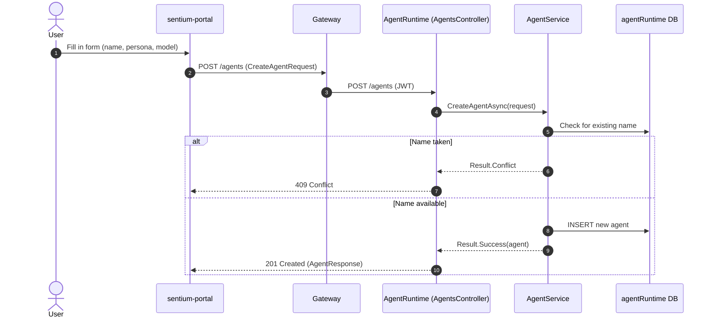

```mermaid
sequenceDiagram
    autonumber
    actor U as User
    participant FE as sentium-portal
    participant GW as Gateway
    participant AR as AgentRuntime (AgentsController)
    participant AS as AgentService
    participant DB as agentRuntime DB

    U->>FE: Fill in form (name, persona, model)
    FE->>GW: POST /agents (CreateAgentRequest)
    GW->>AR: POST /agents (JWT)
    AR->>AS: CreateAgentAsync(request)
    AS->>DB: Check for existing name
    alt Name taken
        AS-->>AR: Result.Conflict
        AR-->>FE: 409 Conflict
    else Name available
        AS->>DB: INSERT new agent
        AS-->>AR: Result.Success(agent)
        AR-->>FE: 201 Created (AgentResponse)
    end
```
