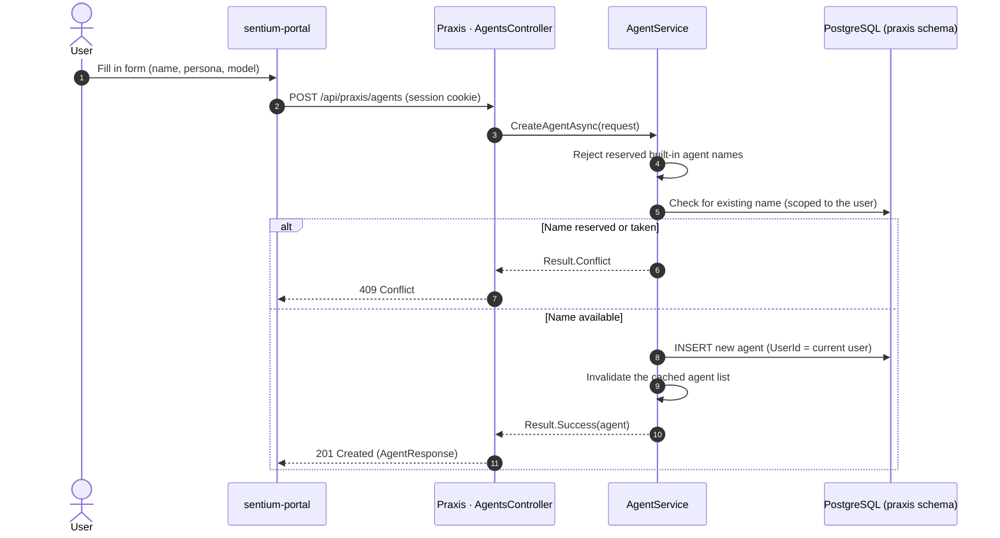

```mermaid
sequenceDiagram
    autonumber
    actor U as User
    participant FE as sentium-portal
    participant AC as Praxis · AgentsController
    participant AS as AgentService
    participant DB as PostgreSQL (praxis schema)

    U->>FE: Fill in form (name, persona, model)
    FE->>AC: POST /api/praxis/agents (session cookie)
    AC->>AS: CreateAgentAsync(request)
    AS->>AS: Reject reserved built-in agent names
    AS->>DB: Check for existing name (scoped to the user)
    alt Name reserved or taken
        AS-->>AC: Result.Conflict
        AC-->>FE: 409 Conflict
    else Name available
        AS->>DB: INSERT new agent (UserId = current user)
        AS->>AS: Invalidate the cached agent list
        AS-->>AC: Result.Success(agent)
        AC-->>FE: 201 Created (AgentResponse)
    end
```
