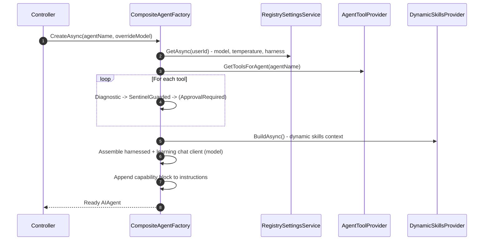

```mermaid
sequenceDiagram
    autonumber
    participant AR as Controller
    participant F as CompositeAgentFactory
    participant RS as RegistrySettingsService
    participant TP as AgentToolProvider
    participant SK as DynamicSkillsProvider

    AR->>F: CreateAsync(agentName, overrideModel)
    F->>RS: GetAsync(userId) - model, temperature, harness
    F->>TP: GetToolsForAgent(agentName)
    loop For each tool
        F->>F: Diagnostic -> SentinelGuarded -> (ApprovalRequired)
    end
    F->>SK: BuildAsync() - dynamic skills context
    F->>F: Assemble harnessed + learning chat client (model)
    F->>F: Append capability block to instructions
    F-->>AR: Ready AIAgent
```
