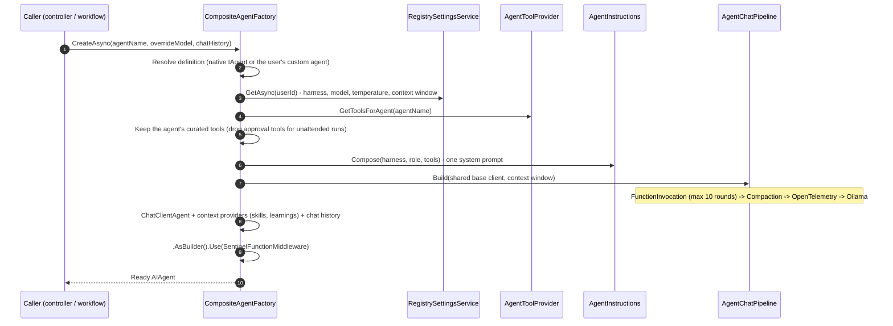

```mermaid
sequenceDiagram
    autonumber
    participant C as Caller (controller / workflow)
    participant F as CompositeAgentFactory
    participant RS as RegistrySettingsService
    participant TP as AgentToolProvider
    participant AI as AgentInstructions
    participant P as AgentChatPipeline

    C->>F: CreateAsync(agentName, overrideModel, chatHistory)
    F->>F: Resolve definition (native IAgent or the user's custom agent)
    F->>RS: GetAsync(userId) - harness, model, temperature, context window
    F->>TP: GetToolsForAgent(agentName)
    F->>F: Keep the agent's curated tools (drop approval tools for unattended runs)
    F->>AI: Compose(harness, role, tools) - one system prompt
    F->>P: Build(shared base client, context window)
    Note over P: FunctionInvocation (max 10 rounds) -> Compaction -> OpenTelemetry -> Ollama
    F->>F: ChatClientAgent + context providers (skills, learnings) + chat history
    F->>F: .AsBuilder().Use(SentinelFunctionMiddleware)
    F-->>C: Ready AIAgent
```
