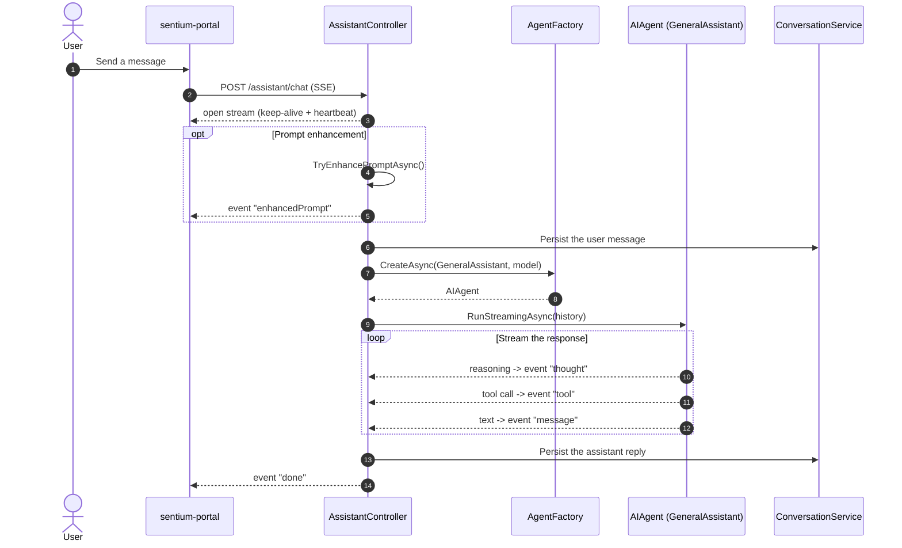

```mermaid
sequenceDiagram
    autonumber
    actor U as User
    participant FE as sentium-portal
    participant AR as AssistantController
    participant F as AgentFactory
    participant AG as AIAgent (GeneralAssistant)
    participant CS as ConversationService

    U->>FE: Send a message
    FE->>AR: POST /assistant/chat (SSE)
    AR-->>FE: open stream (keep-alive + heartbeat)
    opt Prompt enhancement
        AR->>AR: TryEnhancePromptAsync()
        AR-->>FE: event "enhancedPrompt"
    end
    AR->>CS: Persist the user message
    AR->>F: CreateAsync(GeneralAssistant, model)
    F-->>AR: AIAgent
    AR->>AG: RunStreamingAsync(history)
    loop Stream the response
        AG-->>AR: reasoning -> event "thought"
        AG-->>AR: tool call -> event "tool"
        AG-->>AR: text -> event "message"
    end
    AR->>CS: Persist the assistant reply
    AR-->>FE: event "done"
```
