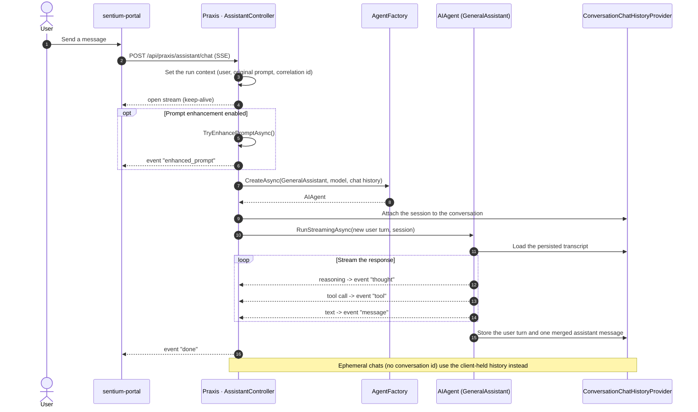

```mermaid
sequenceDiagram
    autonumber
    actor U as User
    participant FE as sentium-portal
    participant AR as Praxis · AssistantController
    participant F as AgentFactory
    participant AG as AIAgent (GeneralAssistant)
    participant CH as ConversationChatHistoryProvider

    U->>FE: Send a message
    FE->>AR: POST /api/praxis/assistant/chat (SSE)
    AR->>AR: Set the run context (user, original prompt, correlation id)
    AR-->>FE: open stream (keep-alive)
    opt Prompt enhancement enabled
        AR->>AR: TryEnhancePromptAsync()
        AR-->>FE: event "enhanced_prompt"
    end
    AR->>F: CreateAsync(GeneralAssistant, model, chat history)
    F-->>AR: AIAgent
    AR->>CH: Attach the session to the conversation
    AR->>AG: RunStreamingAsync(new user turn, session)
    AG->>CH: Load the persisted transcript
    loop Stream the response
        AG-->>AR: reasoning -> event "thought"
        AG-->>AR: tool call -> event "tool"
        AG-->>AR: text -> event "message"
    end
    AG->>CH: Store the user turn and one merged assistant message
    AR-->>FE: event "done"
    Note over AR,CH: Ephemeral chats (no conversation id) use the client-held history instead
```
