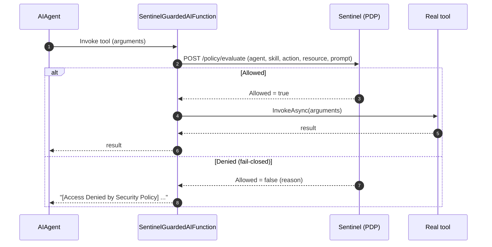

```mermaid
sequenceDiagram
    autonumber
    participant AG as AIAgent
    participant G as SentinelGuardedAIFunction
    participant SE as Sentinel (PDP)
    participant T as Real tool

    AG->>G: Invoke tool (arguments)
    G->>SE: POST /policy/evaluate (agent, skill, action, resource, prompt)
    alt Allowed
        SE-->>G: Allowed = true
        G->>T: InvokeAsync(arguments)
        T-->>G: result
        G-->>AG: result
    else Denied (fail-closed)
        SE-->>G: Allowed = false (reason)
        G-->>AG: "[Access Denied by Security Policy] ..."
    end
```
