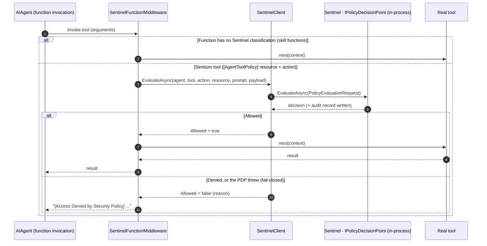

```mermaid
sequenceDiagram
    autonumber
    participant AG as AIAgent (function invocation)
    participant M as SentinelFunctionMiddleware
    participant SC as SentinelClient
    participant PDP as Sentinel · IPolicyDecisionPoint (in-process)
    participant T as Real tool

    AG->>M: Invoke tool (arguments)
    alt Function has no Sentinel classification (skill functions)
        M->>T: next(context)
    else Sentium tool ([AgentToolPolicy] resource + action)
        M->>SC: EvaluateAsync(agent, tool, action, resource, prompt, payload)
        SC->>PDP: EvaluateAsync(PolicyEvaluationRequest)
        PDP-->>SC: decision (+ audit record written)
        alt Allowed
            SC-->>M: Allowed = true
            M->>T: next(context)
            T-->>M: result
            M-->>AG: result
        else Denied, or the PDP threw (fail-closed)
            SC-->>M: Allowed = false (reason)
            M-->>AG: "[Access Denied by Security Policy] ..."
        end
    end
```
