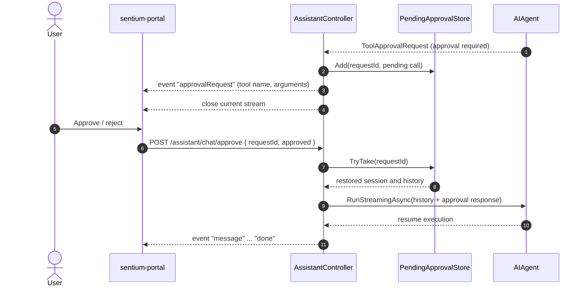

```mermaid
sequenceDiagram
    autonumber
    actor U as User
    participant FE as sentium-portal
    participant AR as AssistantController
    participant PS as PendingApprovalStore
    participant AG as AIAgent

    AG-->>AR: ToolApprovalRequest (approval required)
    AR->>PS: Add(requestId, pending call)
    AR-->>FE: event "approvalRequest" (tool name, arguments)
    AR-->>FE: close current stream
    U->>FE: Approve / reject
    FE->>AR: POST /assistant/chat/approve { requestId, approved }
    AR->>PS: TryTake(requestId)
    PS-->>AR: restored session and history
    AR->>AG: RunStreamingAsync(history + approval response)
    AG-->>AR: resume execution
    AR-->>FE: event "message" ... "done"
```
