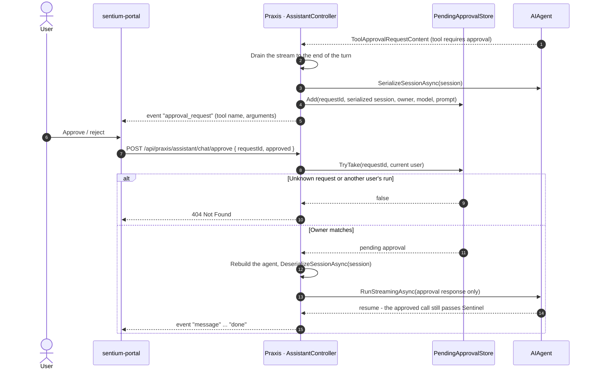

```mermaid
sequenceDiagram
    autonumber
    actor U as User
    participant FE as sentium-portal
    participant AR as Praxis · AssistantController
    participant PS as PendingApprovalStore
    participant AG as AIAgent

    AG-->>AR: ToolApprovalRequestContent (tool requires approval)
    AR->>AR: Drain the stream to the end of the turn
    AR->>AG: SerializeSessionAsync(session)
    AR->>PS: Add(requestId, serialized session, owner, model, prompt)
    AR-->>FE: event "approval_request" (tool name, arguments)
    U->>FE: Approve / reject
    FE->>AR: POST /api/praxis/assistant/chat/approve { requestId, approved }
    AR->>PS: TryTake(requestId, current user)
    alt Unknown request or another user's run
        PS-->>AR: false
        AR-->>FE: 404 Not Found
    else Owner matches
        PS-->>AR: pending approval
        AR->>AR: Rebuild the agent, DeserializeSessionAsync(session)
        AR->>AG: RunStreamingAsync(approval response only)
        AG-->>AR: resume - the approved call still passes Sentinel
        AR-->>FE: event "message" ... "done"
    end
```
