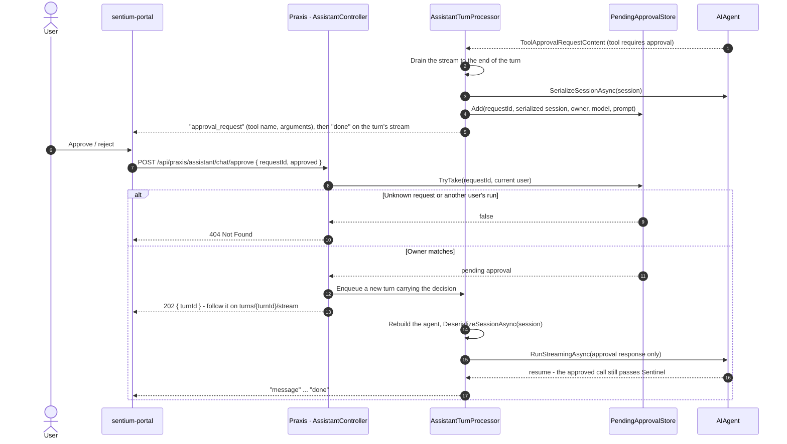

```mermaid
sequenceDiagram
    autonumber
    actor U as User
    participant FE as sentium-portal
    participant AR as Praxis · AssistantController
    participant TP as AssistantTurnProcessor
    participant PS as PendingApprovalStore
    participant AG as AIAgent

    AG-->>TP: ToolApprovalRequestContent (tool requires approval)
    TP->>TP: Drain the stream to the end of the turn
    TP->>AG: SerializeSessionAsync(session)
    TP->>PS: Add(requestId, serialized session, owner, model, prompt)
    TP-->>FE: "approval_request" (tool name, arguments), then "done" on the turn's stream
    U->>FE: Approve / reject
    FE->>AR: POST /api/praxis/assistant/chat/approve { requestId, approved }
    AR->>PS: TryTake(requestId, current user)
    alt Unknown request or another user's run
        PS-->>AR: false
        AR-->>FE: 404 Not Found
    else Owner matches
        PS-->>AR: pending approval
        AR->>TP: Enqueue a new turn carrying the decision
        AR-->>FE: 202 { turnId } - follow it on turns/{turnId}/stream
        TP->>TP: Rebuild the agent, DeserializeSessionAsync(session)
        TP->>AG: RunStreamingAsync(approval response only)
        AG-->>TP: resume - the approved call still passes Sentinel
        TP-->>FE: "message" ... "done"
    end
```
