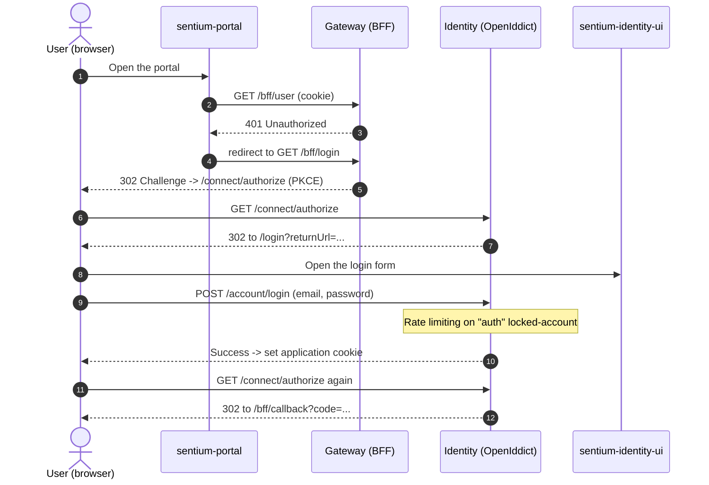

```mermaid
sequenceDiagram
    autonumber
    actor U as User (browser)
    participant FE as sentium-portal
    participant GW as Gateway (BFF)
    participant IDP as Identity (OpenIddict)
    participant IDUI as sentium-identity-ui

    U->>FE: Open the portal
    FE->>GW: GET /bff/user (cookie)
    GW-->>FE: 401 Unauthorized
    FE->>GW: redirect to GET /bff/login
    GW-->>U: 302 Challenge -> /connect/authorize (PKCE)
    U->>IDP: GET /connect/authorize
    IDP-->>U: 302 to /login?returnUrl=...
    U->>IDUI: Open the login form
    U->>IDP: POST /account/login (email, password)
    Note over IDP: Rate limiting on "auth" locked-account
    IDP-->>U: Success -> set application cookie
    U->>IDP: GET /connect/authorize again
    IDP-->>U: 302 to /bff/callback?code=...
```
