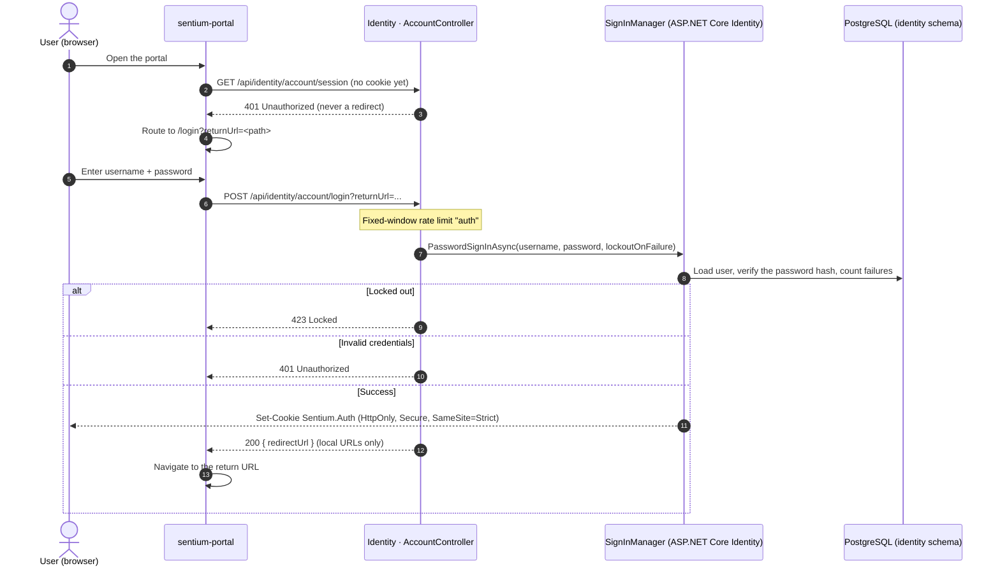

```mermaid
sequenceDiagram
    autonumber
    actor U as User (browser)
    participant FE as sentium-portal
    participant AC as Identity · AccountController
    participant SM as SignInManager (ASP.NET Core Identity)
    participant DB as PostgreSQL (identity schema)

    U->>FE: Open the portal
    FE->>AC: GET /api/identity/account/session (no cookie yet)
    AC-->>FE: 401 Unauthorized (never a redirect)
    FE->>FE: Route to /login?returnUrl=<path>
    U->>FE: Enter username + password
    FE->>AC: POST /api/identity/account/login?returnUrl=...
    Note over AC: Fixed-window rate limit "auth"
    AC->>SM: PasswordSignInAsync(username, password, lockoutOnFailure)
    SM->>DB: Load user, verify the password hash, count failures
    alt Locked out
        AC-->>FE: 423 Locked
    else Invalid credentials
        AC-->>FE: 401 Unauthorized
    else Success
        SM-->>U: Set-Cookie Sentium.Auth (HttpOnly, Secure, SameSite=Strict)
        AC-->>FE: 200 { redirectUrl } (local URLs only)
        FE->>FE: Navigate to the return URL
    end
```
