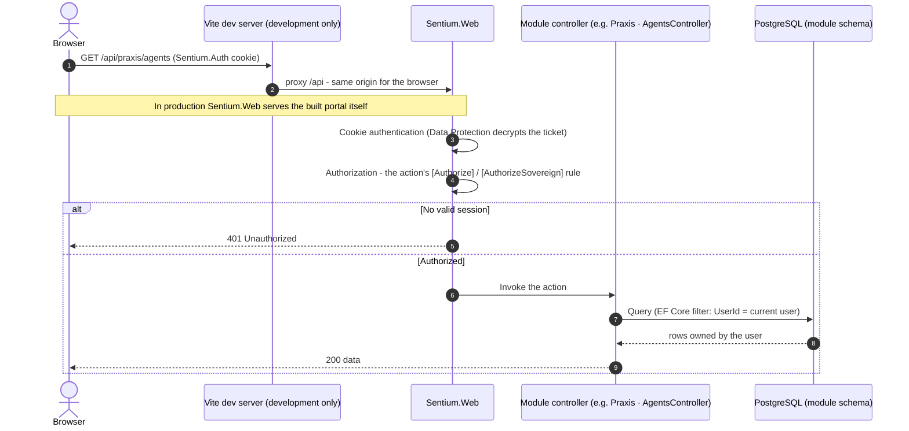

```mermaid
sequenceDiagram
    autonumber
    actor U as Browser
    participant V as Vite dev server (development only)
    participant W as Sentium.Web
    participant C as Module controller (e.g. Praxis · AgentsController)
    participant DB as PostgreSQL (module schema)

    U->>V: GET /api/praxis/agents (Sentium.Auth cookie)
    V->>W: proxy /api - same origin for the browser
    Note over U,W: In production Sentium.Web serves the built portal itself
    W->>W: Cookie authentication (Data Protection decrypts the ticket)
    W->>W: Authorization - the action's [Authorize] / [AuthorizeSovereign] rule
    alt No valid session
        W-->>U: 401 Unauthorized
    else Authorized
        W->>C: Invoke the action
        C->>DB: Query (EF Core filter: UserId = current user)
        DB-->>C: rows owned by the user
        C-->>U: 200 data
    end
```
