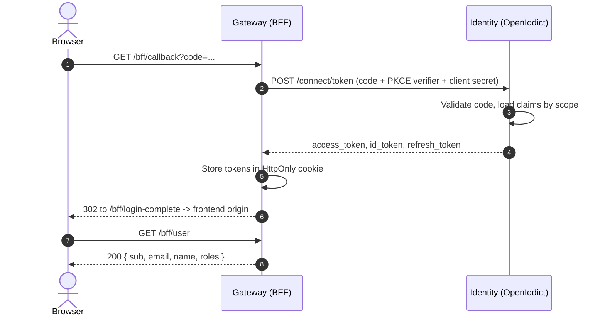

```mermaid
sequenceDiagram
    autonumber
    actor U as Browser
    participant GW as Gateway (BFF)
    participant IDP as Identity (OpenIddict)

    U->>GW: GET /bff/callback?code=...
    GW->>IDP: POST /connect/token (code + PKCE verifier + client secret)
    IDP->>IDP: Validate code, load claims by scope
    IDP-->>GW: access_token, id_token, refresh_token
    GW->>GW: Store tokens in HttpOnly cookie
    GW-->>U: 302 to /bff/login-complete -> frontend origin
    U->>GW: GET /bff/user
    GW-->>U: 200 { sub, email, name, roles }
```
