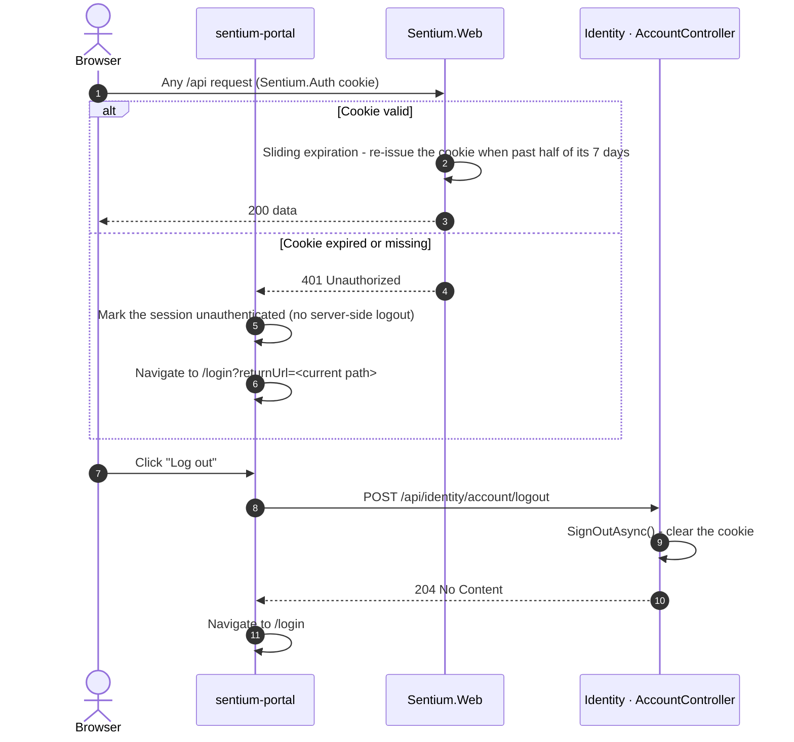

```mermaid
sequenceDiagram
    autonumber
    actor U as Browser
    participant FE as sentium-portal
    participant W as Sentium.Web
    participant AC as Identity · AccountController

    U->>W: Any /api request (Sentium.Auth cookie)
    alt Cookie valid
        W->>W: Sliding expiration - re-issue the cookie when past half of its 7 days
        W-->>U: 200 data
    else Cookie expired or missing
        W-->>FE: 401 Unauthorized
        FE->>FE: Mark the session unauthenticated (no server-side logout)
        FE->>FE: Navigate to /login?returnUrl=<current path>
    end
    U->>FE: Click "Log out"
    FE->>AC: POST /api/identity/account/logout
    AC->>AC: SignOutAsync() - clear the cookie
    AC-->>FE: 204 No Content
    FE->>FE: Navigate to /login
```
