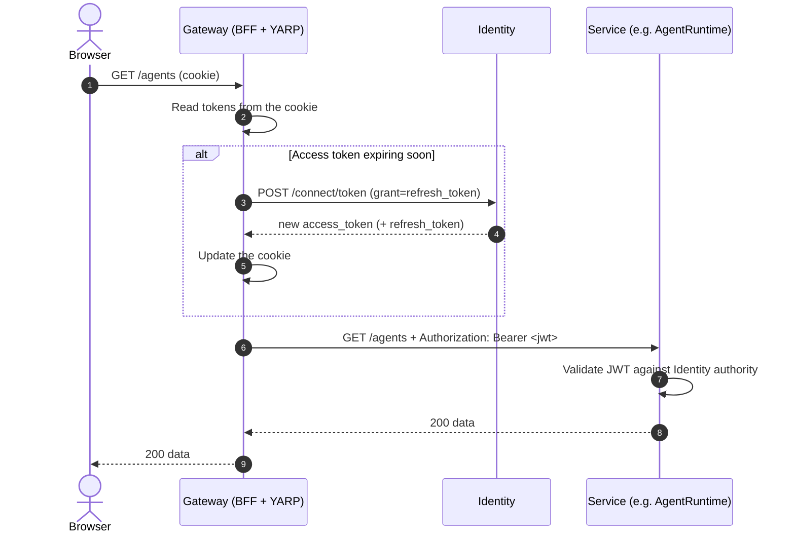

```mermaid
sequenceDiagram
    autonumber
    actor U as Browser
    participant GW as Gateway (BFF + YARP)
    participant IDP as Identity
    participant SVC as Service (e.g. AgentRuntime)

    U->>GW: GET /agents (cookie)
    GW->>GW: Read tokens from the cookie
    alt Access token expiring soon
        GW->>IDP: POST /connect/token (grant=refresh_token)
        IDP-->>GW: new access_token (+ refresh_token)
        GW->>GW: Update the cookie
    end
    GW->>SVC: GET /agents + Authorization: Bearer <jwt>
    SVC->>SVC: Validate JWT against Identity authority
    SVC-->>GW: 200 data
    GW-->>U: 200 data
```
