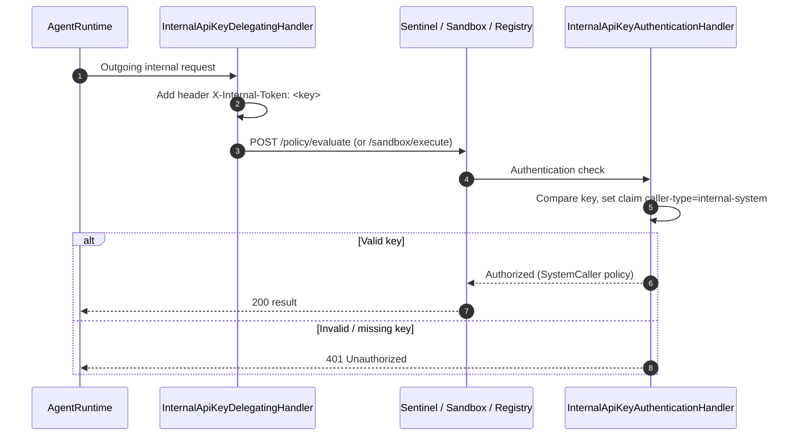

```mermaid
sequenceDiagram
    autonumber
    participant AR as AgentRuntime
    participant H as InternalApiKeyDelegatingHandler
    participant SE as Sentinel / Sandbox / Registry
    participant AH as InternalApiKeyAuthenticationHandler

    AR->>H: Outgoing internal request
    H->>H: Add header X-Internal-Token: <key>
    H->>SE: POST /policy/evaluate (or /sandbox/execute)
    SE->>AH: Authentication check
    AH->>AH: Compare key, set claim caller-type=internal-system
    alt Valid key
        AH-->>SE: Authorized (SystemCaller policy)
        SE-->>AR: 200 result
    else Invalid / missing key
        AH-->>AR: 401 Unauthorized
    end
```
