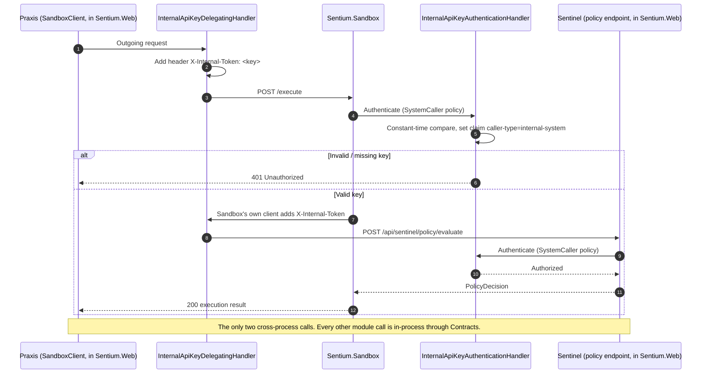

```mermaid
sequenceDiagram
    autonumber
    participant PX as Praxis (SandboxClient, in Sentium.Web)
    participant H as InternalApiKeyDelegatingHandler
    participant SB as Sentium.Sandbox
    participant AH as InternalApiKeyAuthenticationHandler
    participant SN as Sentinel (policy endpoint, in Sentium.Web)

    PX->>H: Outgoing request
    H->>H: Add header X-Internal-Token: <key>
    H->>SB: POST /execute
    SB->>AH: Authenticate (SystemCaller policy)
    AH->>AH: Constant-time compare, set claim caller-type=internal-system
    alt Invalid / missing key
        AH-->>PX: 401 Unauthorized
    else Valid key
        SB->>H: Sandbox's own client adds X-Internal-Token
        H->>SN: POST /api/sentinel/policy/evaluate
        SN->>AH: Authenticate (SystemCaller policy)
        AH-->>SN: Authorized
        SN-->>SB: PolicyDecision
        SB-->>PX: 200 execution result
    end
    Note over PX,SN: The only two cross-process calls. Every other module call is in-process through Contracts.
```
