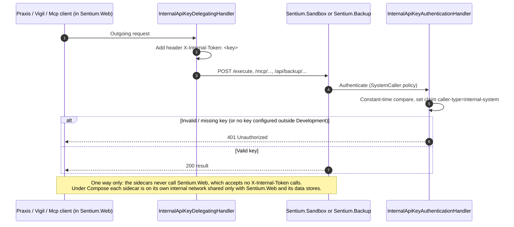

```mermaid
sequenceDiagram
    autonumber
    participant PX as Praxis / Vigil / Mcp client (in Sentium.Web)
    participant H as InternalApiKeyDelegatingHandler
    participant SC as Sentium.Sandbox or Sentium.Backup
    participant AH as InternalApiKeyAuthenticationHandler

    PX->>H: Outgoing request
    H->>H: Add header X-Internal-Token: <key>
    H->>SC: POST /execute, /mcp/..., /api/backup/...
    SC->>AH: Authenticate (SystemCaller policy)
    AH->>AH: Constant-time compare, set claim caller-type=internal-system
    alt Invalid / missing key (or no key configured outside Development)
        AH-->>PX: 401 Unauthorized
    else Valid key
        SC-->>PX: 200 result
    end
    Note over PX,SC: One way only: the sidecars never call Sentium.Web, which accepts no X-Internal-Token calls.<br/>Under Compose each sidecar is on its own internal network shared only with Sentium.Web and its data stores.
```
