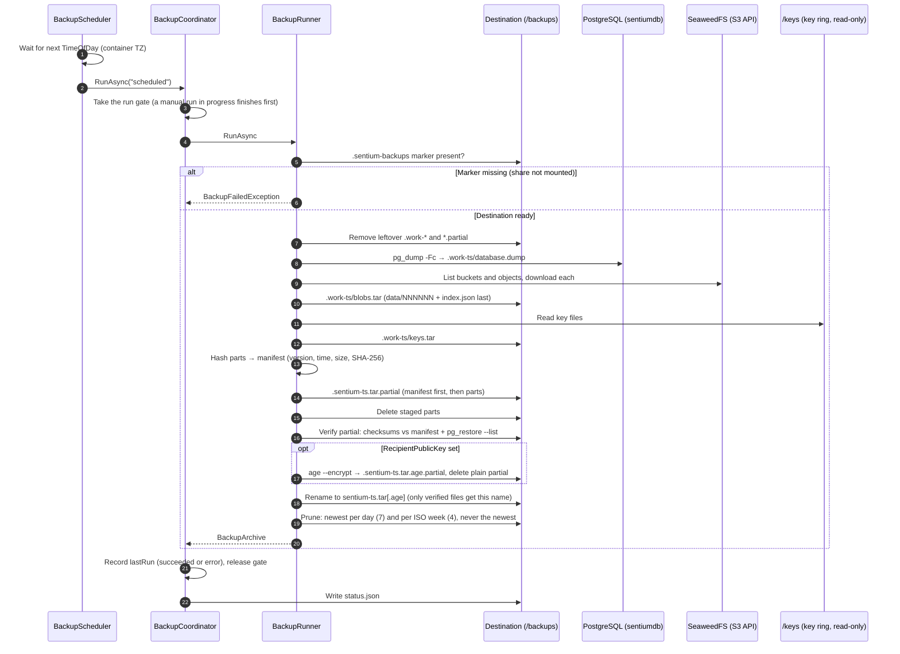

```mermaid
sequenceDiagram
    autonumber
    participant SCH as BackupScheduler
    participant CO as BackupCoordinator
    participant BR as BackupRunner
    participant DST as Destination (/backups)
    participant PG as PostgreSQL (sentiumdb)
    participant AZ as SeaweedFS (S3 API)
    participant K as /keys (key ring, read-only)

    SCH->>SCH: Wait for next TimeOfDay (container TZ)
    SCH->>CO: RunAsync("scheduled")
    CO->>CO: Take the run gate (a manual run in progress finishes first)
    CO->>BR: RunAsync
    BR->>DST: .sentium-backups marker present?
    alt Marker missing (share not mounted)
        BR-->>CO: BackupFailedException
    else Destination ready
        BR->>DST: Remove leftover .work-* and *.partial
        BR->>PG: pg_dump -Fc → .work-ts/database.dump
        BR->>AZ: List buckets and objects, download each
        BR->>DST: .work-ts/blobs.tar (data/NNNNNN + index.json last)
        BR->>K: Read key files
        BR->>DST: .work-ts/keys.tar
        BR->>BR: Hash parts → manifest (version, time, size, SHA-256)
        BR->>DST: .sentium-ts.tar.partial (manifest first, then parts)
        BR->>DST: Delete staged parts
        BR->>DST: Verify partial: checksums vs manifest + pg_restore --list
        opt RecipientPublicKey set
            BR->>DST: age --encrypt → .sentium-ts.tar.age.partial, delete plain partial
        end
        BR->>DST: Rename to sentium-ts.tar[.age] (only verified files get this name)
        BR->>DST: Prune: newest per day (7) and per ISO week (4), never the newest
        BR-->>CO: BackupArchive
    end
    CO->>CO: Record lastRun (succeeded or error), release gate
    CO->>DST: Write status.json
```
