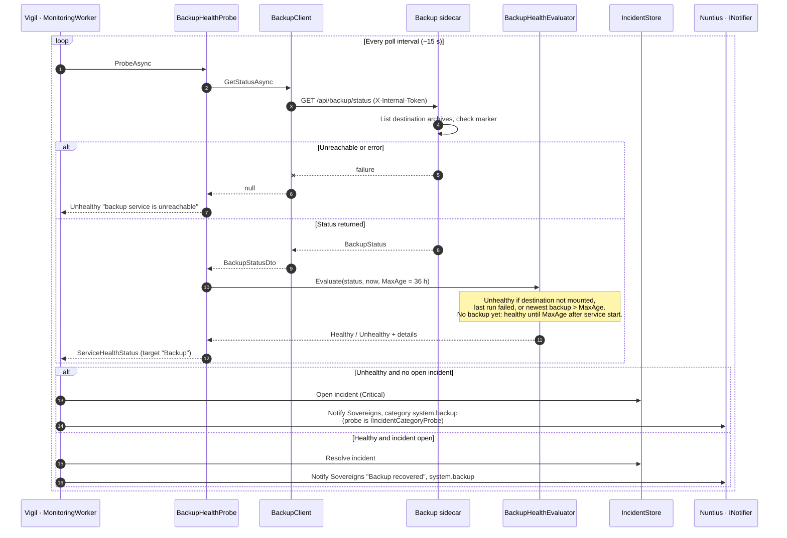

```mermaid
sequenceDiagram
    autonumber
    participant MW as Vigil · MonitoringWorker
    participant BP as BackupHealthProbe
    participant BC as BackupClient
    participant SC as Backup sidecar
    participant EV as BackupHealthEvaluator
    participant IS as IncidentStore
    participant NT as Nuntius · INotifier

    loop Every poll interval (~15 s)
        MW->>BP: ProbeAsync
        BP->>BC: GetStatusAsync
        BC->>SC: GET /api/backup/status (X-Internal-Token)
        SC->>SC: List destination archives, check marker
        alt Unreachable or error
            SC--xBC: failure
            BC-->>BP: null
            BP-->>MW: Unhealthy "backup service is unreachable"
        else Status returned
            SC-->>BC: BackupStatus
            BC-->>BP: BackupStatusDto
            BP->>EV: Evaluate(status, now, MaxAge = 36 h)
            Note over EV: Unhealthy if destination not mounted,<br/>last run failed, or newest backup > MaxAge.<br/>No backup yet: healthy until MaxAge after service start.
            EV-->>BP: Healthy / Unhealthy + details
            BP-->>MW: ServiceHealthStatus (target "Backup")
        end
        alt Unhealthy and no open incident
            MW->>IS: Open incident (Critical)
            MW->>NT: Notify Sovereigns, category system.backup<br/>(probe is IIncidentCategoryProbe)
        else Healthy and incident open
            MW->>IS: Resolve incident
            MW->>NT: Notify Sovereigns "Backup recovered", system.backup
        end
    end
```
