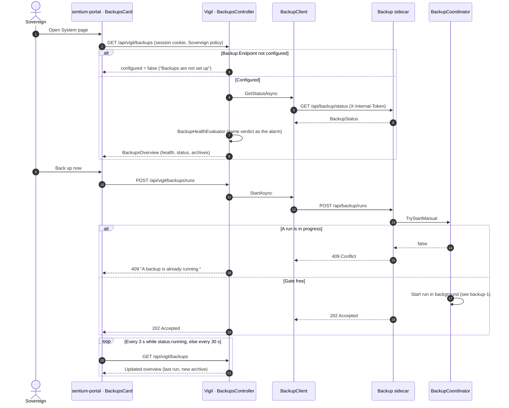

```mermaid
sequenceDiagram
    autonumber
    actor S as Sovereign
    participant FE as sentium-portal · BackupsCard
    participant VC as Vigil · BackupsController
    participant BC as BackupClient
    participant SC as Backup sidecar
    participant CO as BackupCoordinator

    S->>FE: Open System page
    FE->>VC: GET /api/vigil/backups (session cookie, Sovereign policy)
    alt Backup:Endpoint not configured
        VC-->>FE: configured = false ("Backups are not set up")
    else Configured
        VC->>BC: GetStatusAsync
        BC->>SC: GET /api/backup/status (X-Internal-Token)
        SC-->>BC: BackupStatus
        VC->>VC: BackupHealthEvaluator (same verdict as the alarm)
        VC-->>FE: BackupsOverview (health, status, archives)
    end

    S->>FE: Back up now
    FE->>VC: POST /api/vigil/backups/runs
    VC->>BC: StartAsync
    BC->>SC: POST /api/backup/runs
    SC->>CO: TryStartManual
    alt A run is in progress
        CO-->>SC: false
        SC-->>BC: 409 Conflict
        VC-->>FE: 409 "A backup is already running."
    else Gate free
        CO->>CO: Start run in background (see backup-1)
        SC-->>BC: 202 Accepted
        VC-->>FE: 202 Accepted
    end
    loop Every 3 s while status.running, else every 30 s
        FE->>VC: GET /api/vigil/backups
        VC-->>FE: Updated overview (last run, new archive)
    end
```
