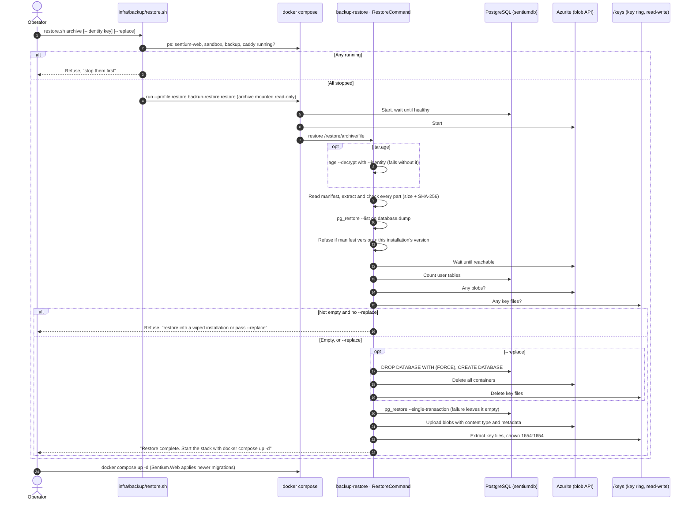

```mermaid
sequenceDiagram
    autonumber
    actor O as Operator
    participant SH as infra/backup/restore.sh
    participant DC as docker compose
    participant RC as backup-restore · RestoreCommand
    participant PG as PostgreSQL (sentiumdb)
    participant AZ as Azurite (blob API)
    participant K as /keys (key ring, read-write)

    O->>SH: restore.sh archive [--identity key] [--replace]
    SH->>DC: ps: sentium-web, sandbox, backup, caddy running?
    alt Any running
        SH-->>O: Refuse, "stop them first"
    else All stopped
        SH->>DC: run --profile restore backup-restore restore (archive mounted read-only)
        DC->>PG: Start, wait until healthy
        DC->>AZ: Start
        DC->>RC: restore /restore/archive/file
        opt .tar.age
            RC->>RC: age --decrypt with --identity (fails without it)
        end
        RC->>RC: Read manifest, extract and check every part (size + SHA-256)
        RC->>RC: pg_restore --list on database.dump
        RC->>RC: Refuse if manifest version > this installation's version
        RC->>AZ: Wait until reachable
        RC->>PG: Count user tables
        RC->>AZ: Any blobs?
        RC->>K: Any key files?
        alt Not empty and no --replace
            RC-->>O: Refuse, "restore into a wiped installation or pass --replace"
        else Empty, or --replace
            opt --replace
                RC->>PG: DROP DATABASE WITH (FORCE), CREATE DATABASE
                RC->>AZ: Delete all containers
                RC->>K: Delete key files
            end
            RC->>PG: pg_restore --single-transaction (failure leaves it empty)
            RC->>AZ: Upload blobs with content type and metadata
            RC->>K: Extract key files, chown 1654:1654
            RC-->>O: "Restore complete. Start the stack with docker compose up -d"
        end
    end
    O->>DC: docker compose up -d (Sentium.Web applies newer migrations)
```
