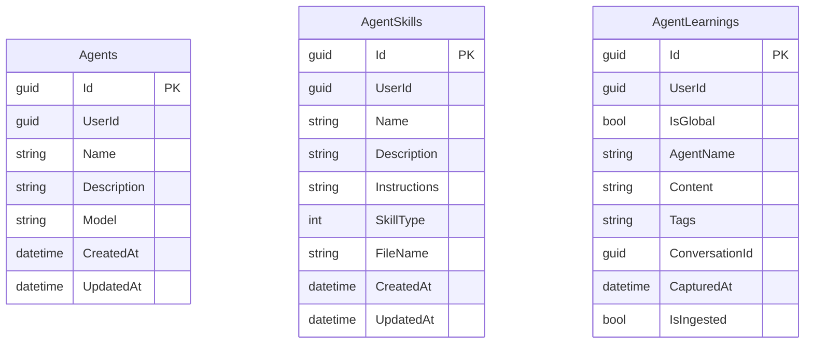
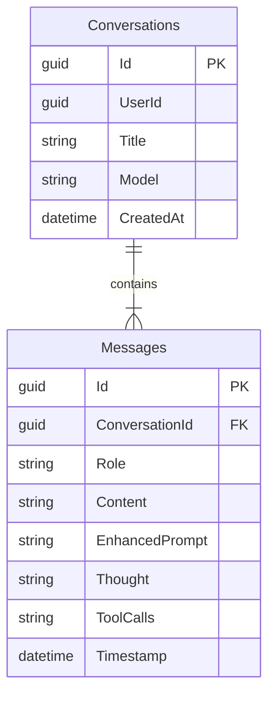
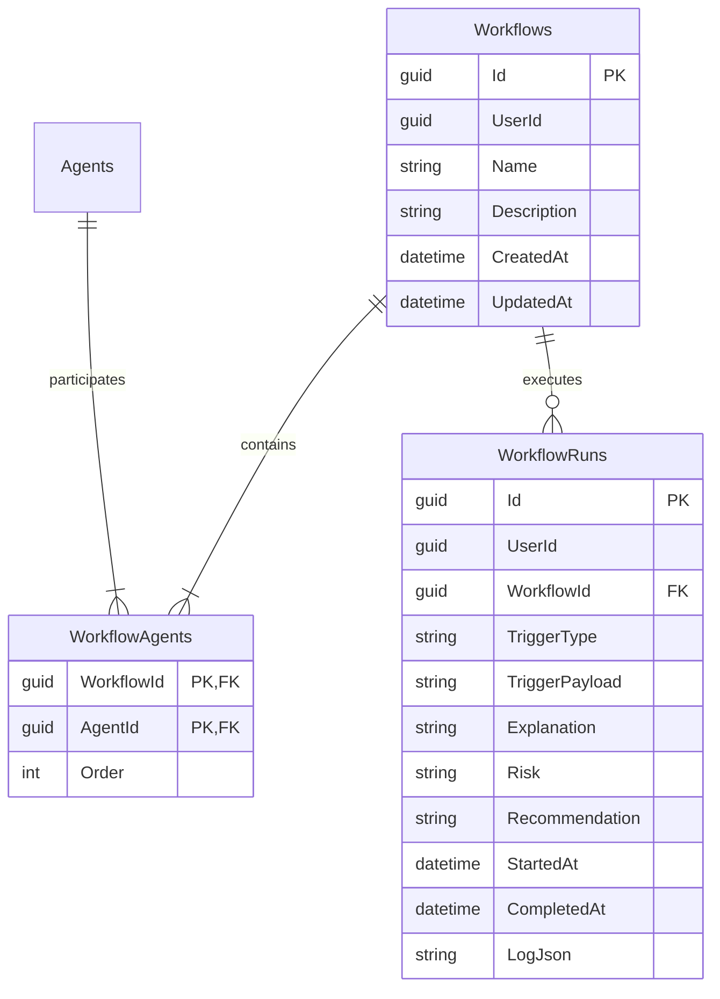
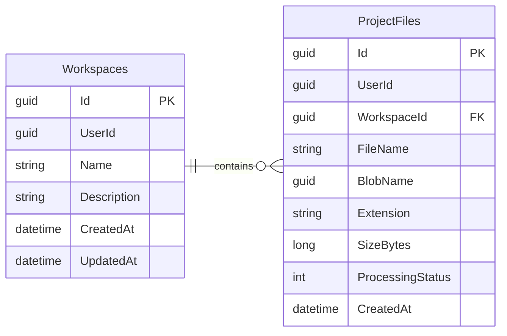
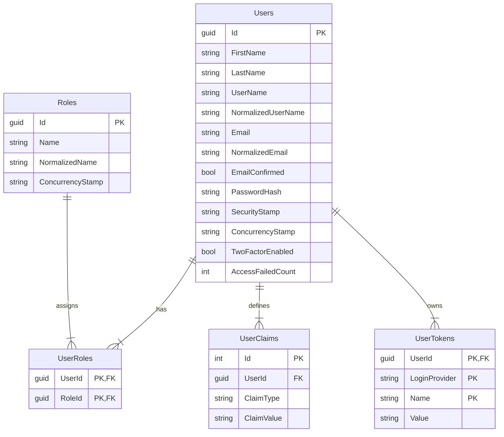
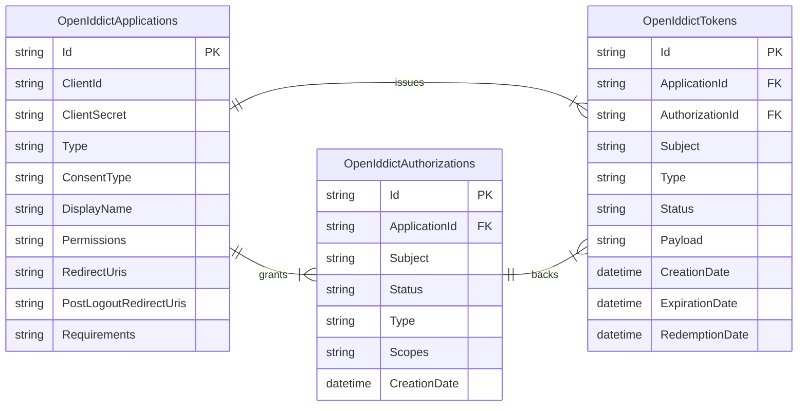
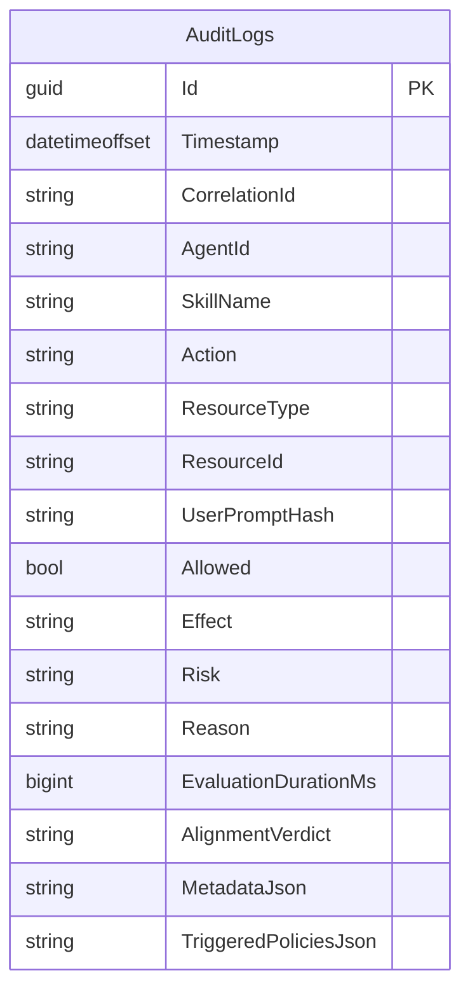
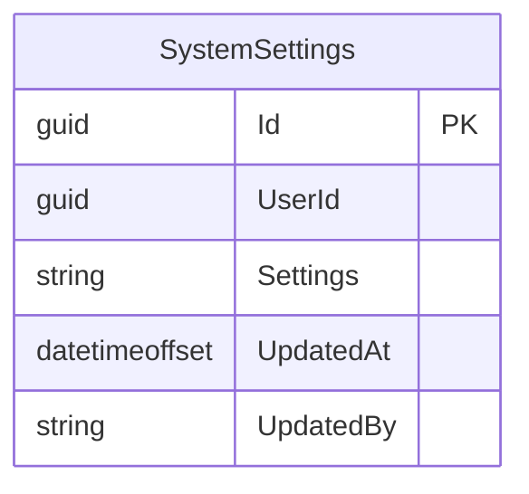
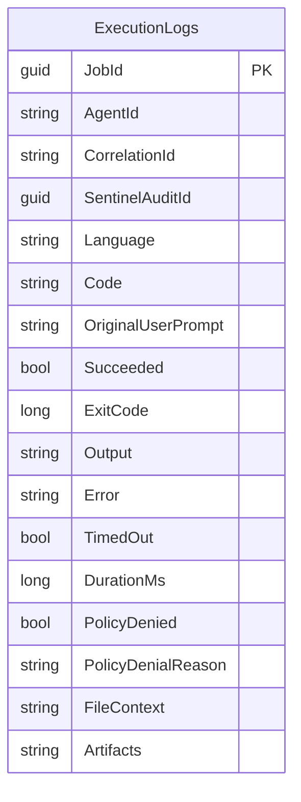

# Agent Core & Skills Domain

# Conversations Domain

# Workflow Domain

# Workspace Domain

## Identity Domain

## OpenIddict Domain

# Audit Domain

# Settings Domain

# Execution Domain

