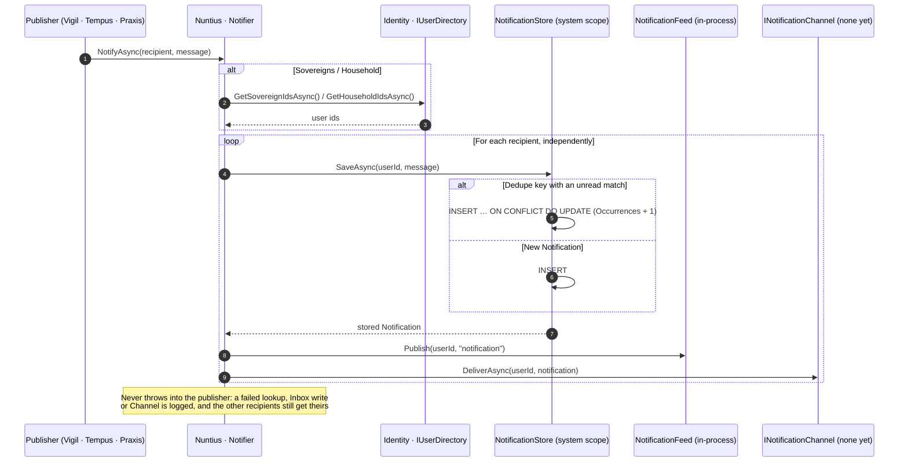

```mermaid
sequenceDiagram
    autonumber
    participant P as Publisher (Vigil · Tempus · Praxis)
    participant N as Nuntius · Notifier
    participant D as Identity · IUserDirectory
    participant S as NotificationStore (system scope)
    participant F as NotificationFeed (in-process)
    participant C as INotificationChannel (none yet)

    P->>N: NotifyAsync(recipient, message)
    alt Sovereigns / Household
        N->>D: GetSovereignIdsAsync() / GetHouseholdIdsAsync()
        D-->>N: user ids
    end
    loop For each recipient, independently
        N->>S: SaveAsync(userId, message)
        alt Dedupe key with an unread match
            S->>S: INSERT … ON CONFLICT DO UPDATE (Occurrences + 1)
        else New Notification
            S->>S: INSERT
        end
        S-->>N: stored Notification
        N->>F: Publish(userId, "notification")
        N->>C: DeliverAsync(userId, notification)
    end
    Note over N: Never throws into the publisher: a failed lookup, Inbox write<br/>or Channel is logged, and the other recipients still get theirs
```
