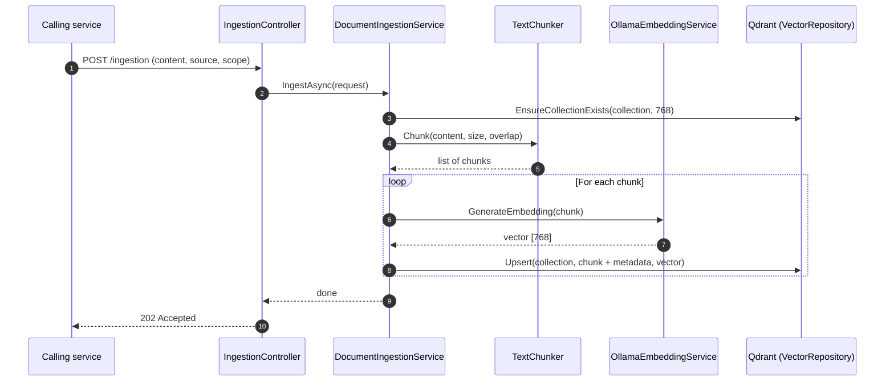

```mermaid
sequenceDiagram
    autonumber
    participant C as Calling service
    participant IC as IngestionController
    participant DI as DocumentIngestionService
    participant TC as TextChunker
    participant EM as OllamaEmbeddingService
    participant Q as Qdrant (VectorRepository)

    C->>IC: POST /ingestion (content, source, scope)
    IC->>DI: IngestAsync(request)
    DI->>Q: EnsureCollectionExists(collection, 768)
    DI->>TC: Chunk(content, size, overlap)
    TC-->>DI: list of chunks
    loop For each chunk
        DI->>EM: GenerateEmbedding(chunk)
        EM-->>DI: vector [768]
        DI->>Q: Upsert(collection, chunk + metadata, vector)
    end
    DI-->>IC: done
    IC-->>C: 202 Accepted
```
