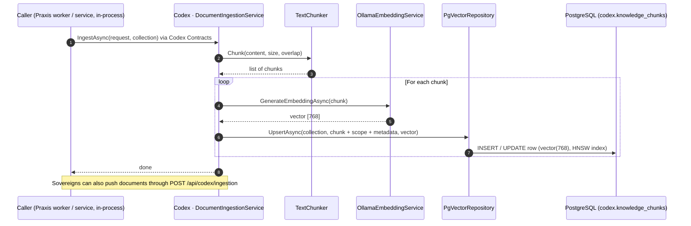

```mermaid
sequenceDiagram
    autonumber
    participant C as Caller (Praxis worker / service, in-process)
    participant DI as Codex · DocumentIngestionService
    participant TC as TextChunker
    participant EM as OllamaEmbeddingService
    participant VR as PgVectorRepository
    participant PG as PostgreSQL (codex.knowledge_chunks)

    C->>DI: IngestAsync(request, collection) via Codex Contracts
    DI->>TC: Chunk(content, size, overlap)
    TC-->>DI: list of chunks
    loop For each chunk
        DI->>EM: GenerateEmbeddingAsync(chunk)
        EM-->>DI: vector [768]
        DI->>VR: UpsertAsync(collection, chunk + scope + metadata, vector)
        VR->>PG: INSERT / UPDATE row (vector(768), HNSW index)
    end
    DI-->>C: done
    Note over C,DI: Sovereigns can also push documents through POST /api/codex/ingestion
```
