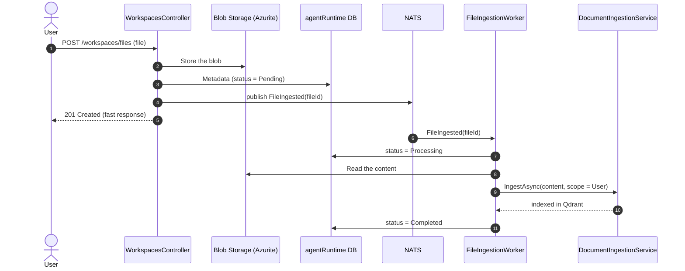

```mermaid
sequenceDiagram
    autonumber
    actor U as User
    participant WC as WorkspacesController
    participant BL as Blob Storage (Azurite)
    participant DB as agentRuntime DB
    participant NATS as NATS
    participant FW as FileIngestionWorker
    participant DI as DocumentIngestionService

    U->>WC: POST /workspaces/files (file)
    WC->>BL: Store the blob
    WC->>DB: Metadata (status = Pending)
    WC->>NATS: publish FileIngested(fileId)
    WC-->>U: 201 Created (fast response)
    NATS->>FW: FileIngested(fileId)
    FW->>DB: status = Processing
    FW->>BL: Read the content
    FW->>DI: IngestAsync(content, scope = User)
    DI-->>FW: indexed in Qdrant
    FW->>DB: status = Completed
```
