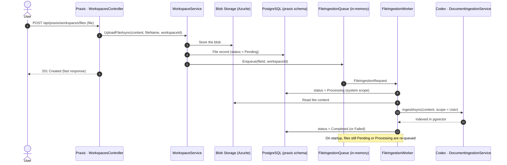

```mermaid
sequenceDiagram
    autonumber
    actor U as User
    participant WC as Praxis · WorkspacesController
    participant WS as WorkspaceService
    participant BL as Blob Storage (Azurite)
    participant DB as PostgreSQL (praxis schema)
    participant Q as FileIngestionQueue (in-memory)
    participant FW as FileIngestionWorker
    participant DI as Codex · DocumentIngestionService

    U->>WC: POST /api/praxis/workspaces/files (file)
    WC->>WS: UploadFileAsync(content, fileName, workspaceId)
    WS->>BL: Store the blob
    WS->>DB: File record (status = Pending)
    WS->>Q: Enqueue(fileId, workspaceId)
    WC-->>U: 201 Created (fast response)
    Q->>FW: FileIngestionRequest
    FW->>DB: status = Processing (system scope)
    FW->>BL: Read the content
    FW->>DI: IngestAsync(content, scope = User)
    DI-->>FW: indexed in pgvector
    FW->>DB: status = Completed (or Failed)
    Note over Q,FW: On startup, files still Pending or Processing are re-queued
```
