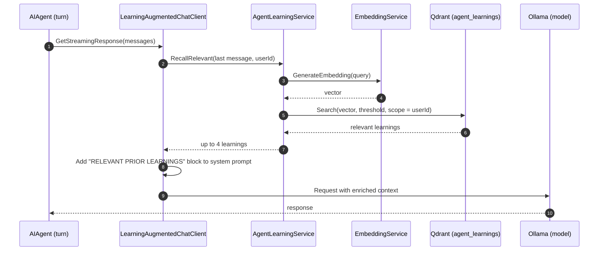

```mermaid
sequenceDiagram
    autonumber
    participant AG as AIAgent (turn)
    participant LA as LearningAugmentedChatClient
    participant LS as AgentLearningService
    participant EM as EmbeddingService
    participant Q as Qdrant (agent_learnings)
    participant LLM as Ollama (model)

    AG->>LA: GetStreamingResponse(messages)
    LA->>LS: RecallRelevant(last message, userId)
    LS->>EM: GenerateEmbedding(query)
    EM-->>LS: vector
    LS->>Q: Search(vector, threshold, scope = userId)
    Q-->>LS: relevant learnings
    LS-->>LA: up to 4 learnings
    LA->>LA: Add "RELEVANT PRIOR LEARNINGS" block to system prompt
    LA->>LLM: Request with enriched context
    LLM-->>AG: response
```
