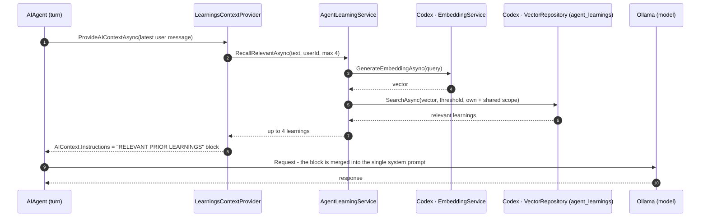

```mermaid
sequenceDiagram
    autonumber
    participant AG as AIAgent (turn)
    participant LP as LearningsContextProvider
    participant LS as AgentLearningService
    participant EM as Codex · EmbeddingService
    participant VR as Codex · VectorRepository (agent_learnings)
    participant LLM as Ollama (model)

    AG->>LP: ProvideAIContextAsync(latest user message)
    LP->>LS: RecallRelevantAsync(text, userId, max 4)
    LS->>EM: GenerateEmbeddingAsync(query)
    EM-->>LS: vector
    LS->>VR: SearchAsync(vector, threshold, own + shared scope)
    VR-->>LS: relevant learnings
    LS-->>LP: up to 4 learnings
    LP-->>AG: AIContext.Instructions = "RELEVANT PRIOR LEARNINGS" block
    AG->>LLM: Request - the block is merged into the single system prompt
    LLM-->>AG: response
```
