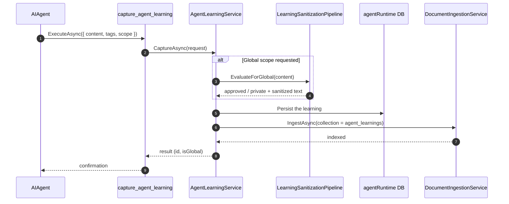

```mermaid
sequenceDiagram
    autonumber
    participant AG as AIAgent
    participant CT as capture_agent_learning
    participant LS as AgentLearningService
    participant SP as LearningSanitizationPipeline
    participant DB as agentRuntime DB
    participant DI as DocumentIngestionService

    AG->>CT: ExecuteAsync({ content, tags, scope })
    CT->>LS: CaptureAsync(request)
    alt Global scope requested
        LS->>SP: EvaluateForGlobal(content)
        SP-->>LS: approved / private + sanitized text
    end
    LS->>DB: Persist the learning
    LS->>DI: IngestAsync(collection = agent_learnings)
    DI-->>LS: indexed
    LS-->>CT: result (id, isGlobal)
    CT-->>AG: confirmation
```
