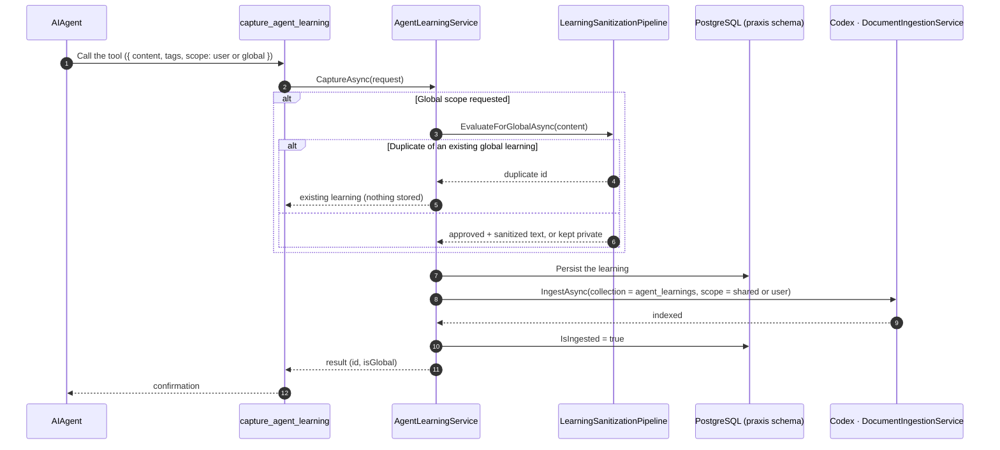

```mermaid
sequenceDiagram
    autonumber
    participant AG as AIAgent
    participant CT as capture_agent_learning
    participant LS as AgentLearningService
    participant SP as LearningSanitizationPipeline
    participant DB as PostgreSQL (praxis schema)
    participant DI as Codex · DocumentIngestionService

    AG->>CT: Call the tool ({ content, tags, scope: user or global })
    CT->>LS: CaptureAsync(request)
    alt Global scope requested
        LS->>SP: EvaluateForGlobalAsync(content)
        alt Duplicate of an existing global learning
            SP-->>LS: duplicate id
            LS-->>CT: existing learning (nothing stored)
        else
            SP-->>LS: approved + sanitized text, or kept private
        end
    end
    LS->>DB: Persist the learning
    LS->>DI: IngestAsync(collection = agent_learnings, scope = shared or user)
    DI-->>LS: indexed
    LS->>DB: IsIngested = true
    LS-->>CT: result (id, isGlobal)
    CT-->>AG: confirmation
```
