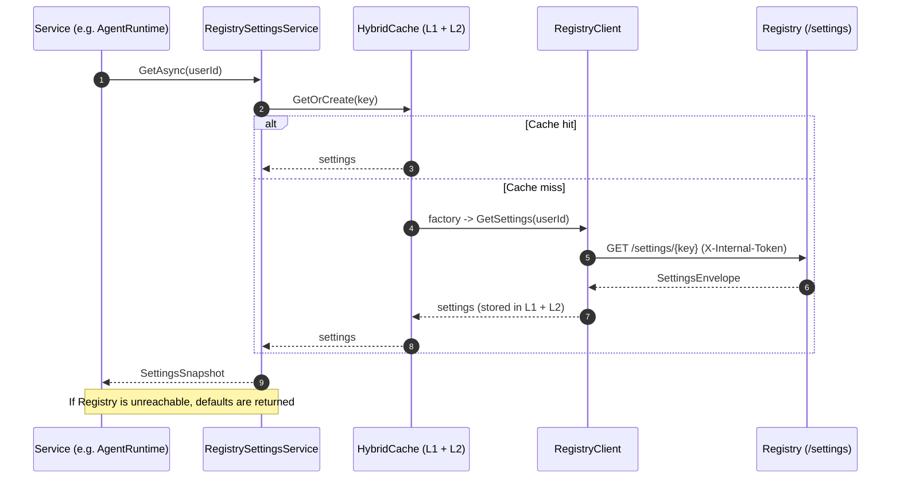

```mermaid
sequenceDiagram
    autonumber
    participant SVC as Service (e.g. AgentRuntime)
    participant RS as RegistrySettingsService
    participant HC as HybridCache (L1 + L2)
    participant RC as RegistryClient
    participant RG as Registry (/settings)

    SVC->>RS: GetAsync(userId)
    RS->>HC: GetOrCreate(key)
    alt Cache hit
        HC-->>RS: settings
    else Cache miss
        HC->>RC: factory -> GetSettings(userId)
        RC->>RG: GET /settings/{key} (X-Internal-Token)
        RG-->>RC: SettingsEnvelope
        RC-->>HC: settings (stored in L1 + L2)
        HC-->>RS: settings
    end
    RS-->>SVC: SettingsSnapshot
    Note over RS,SVC: If Registry is unreachable, defaults are returned
```
