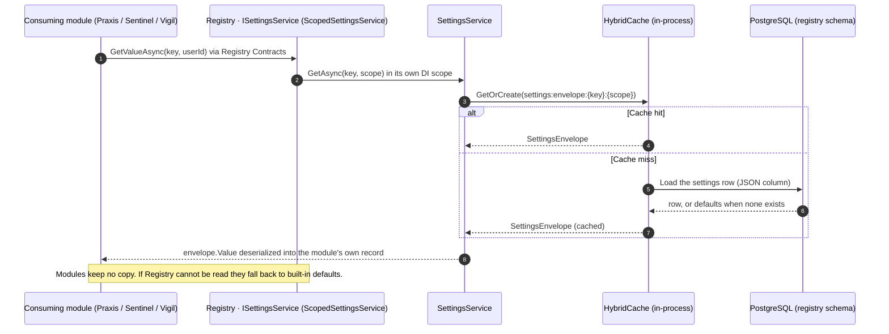

```mermaid
sequenceDiagram
    autonumber
    participant M as Consuming module (Praxis / Sentinel / Vigil)
    participant SS as Registry · ISettingsService (ScopedSettingsService)
    participant SV as SettingsService
    participant HC as HybridCache (in-process)
    participant DB as PostgreSQL (registry schema)

    M->>SS: GetValueAsync(key, userId) via Registry Contracts
    SS->>SV: GetAsync(key, scope) in its own DI scope
    SV->>HC: GetOrCreate(settings:envelope:{key}:{scope})
    alt Cache hit
        HC-->>SV: SettingsEnvelope
    else Cache miss
        HC->>DB: Load the settings row (JSON column)
        DB-->>HC: row, or defaults when none exists
        HC-->>SV: SettingsEnvelope (cached)
    end
    SV-->>M: envelope.Value deserialized into the module's own record
    Note over M,SS: Modules keep no copy. If Registry cannot be read they fall back to built-in defaults.
```
