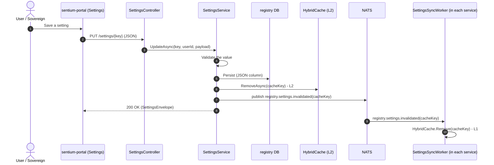

```mermaid
sequenceDiagram
    autonumber
    actor U as User / Sovereign
    participant FE as sentium-portal (Settings)
    participant SC as SettingsController
    participant SS as SettingsService
    participant DB as registry DB
    participant HC as HybridCache (L2)
    participant NATS as NATS
    participant SW as SettingsSyncWorker (in each service)

    U->>FE: Save a setting
    FE->>SC: PUT /settings/{key} (JSON)
    SC->>SS: UpdateAsync(key, userId, payload)
    SS->>SS: Validate the value
    SS->>DB: Persist (JSON column)
    SS->>HC: RemoveAsync(cacheKey) - L2
    SS->>NATS: publish registry.settings.invalidated(cacheKey)
    SS-->>FE: 200 OK (SettingsEnvelope)
    NATS->>SW: registry.settings.invalidated(cacheKey)
    SW->>SW: HybridCache.Remove(cacheKey) - L1
```
