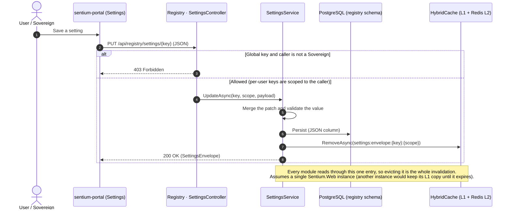

```mermaid
sequenceDiagram
    autonumber
    actor U as User / Sovereign
    participant FE as sentium-portal (Settings)
    participant SC as Registry · SettingsController
    participant SS as SettingsService
    participant DB as PostgreSQL (registry schema)
    participant HC as HybridCache (L1 + Redis L2)

    U->>FE: Save a setting
    FE->>SC: PUT /api/registry/settings/{key} (JSON)
    alt Global key and caller is not a Sovereign
        SC-->>FE: 403 Forbidden
    else Allowed (per-user keys are scoped to the caller)
        SC->>SS: UpdateAsync(key, scope, payload)
        SS->>SS: Merge the patch and validate the value
        SS->>DB: Persist (JSON column)
        SS->>HC: RemoveAsync(settings:envelope:{key}:{scope})
        SS-->>FE: 200 OK (SettingsEnvelope)
    end
    Note over SS,HC: Every module reads through this one entry, so evicting it is the whole invalidation.<br/>Assumes a single Sentium.Web instance (another instance would keep its L1 copy until it expires).
```
