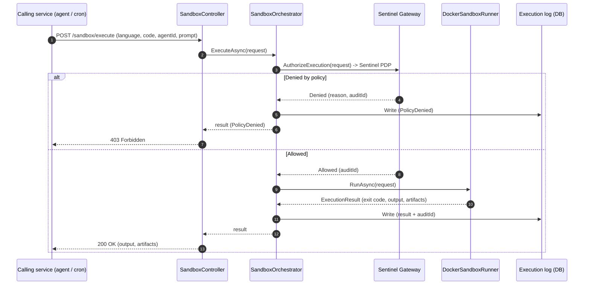

```mermaid
sequenceDiagram
    autonumber
    participant CL as Calling service (agent / cron)
    participant SC as SandboxController
    participant SO as SandboxOrchestrator
    participant SG as Sentinel Gateway
    participant DR as DockerSandboxRunner
    participant LOG as Execution log (DB)

    CL->>SC: POST /sandbox/execute (language, code, agentId, prompt)
    SC->>SO: ExecuteAsync(request)
    SO->>SG: AuthorizeExecution(request) -> Sentinel PDP
    alt Denied by policy
        SG-->>SO: Denied (reason, auditId)
        SO->>LOG: Write (PolicyDenied)
        SO-->>SC: result (PolicyDenied)
        SC-->>CL: 403 Forbidden
    else Allowed
        SG-->>SO: Allowed (auditId)
        SO->>DR: RunAsync(request)
        DR-->>SO: ExecutionResult (exit code, output, artifacts)
        SO->>LOG: Write (result + auditId)
        SO-->>SC: result
        SC-->>CL: 200 OK (output, artifacts)
    end
```
