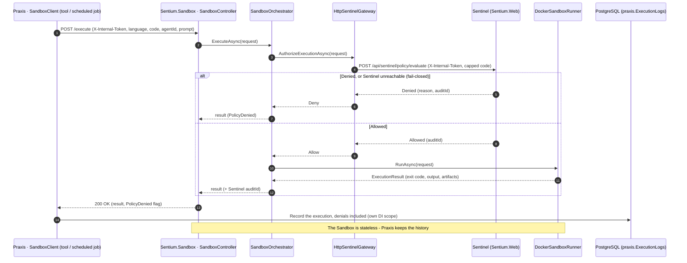

```mermaid
sequenceDiagram
    autonumber
    participant PX as Praxis · SandboxClient (tool / scheduled job)
    participant SC as Sentium.Sandbox · SandboxController
    participant SO as SandboxOrchestrator
    participant SG as HttpSentinelGateway
    participant SN as Sentinel (Sentium.Web)
    participant DR as DockerSandboxRunner
    participant LOG as PostgreSQL (praxis.ExecutionLogs)

    PX->>SC: POST /execute (X-Internal-Token, language, code, agentId, prompt)
    SC->>SO: ExecuteAsync(request)
    SO->>SG: AuthorizeExecutionAsync(request)
    SG->>SN: POST /api/sentinel/policy/evaluate (X-Internal-Token, capped code)
    alt Denied, or Sentinel unreachable (fail-closed)
        SN-->>SG: Denied (reason, auditId)
        SG-->>SO: Deny
        SO-->>SC: result (PolicyDenied)
    else Allowed
        SN-->>SG: Allowed (auditId)
        SG-->>SO: Allow
        SO->>DR: RunAsync(request)
        DR-->>SO: ExecutionResult (exit code, output, artifacts)
        SO-->>SC: result (+ Sentinel auditId)
    end
    SC-->>PX: 200 OK (result, PolicyDenied flag)
    PX->>LOG: Record the execution, denials included (own DI scope)
    Note over SC,DR: The Sandbox is stateless - Praxis keeps the history
```
