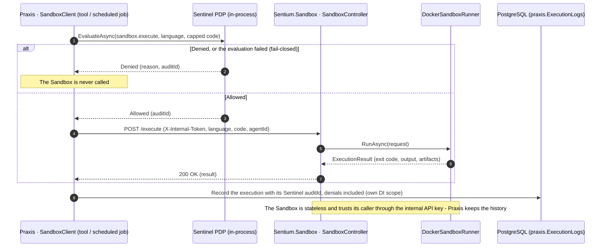

```mermaid
sequenceDiagram
    autonumber
    participant PX as Praxis · SandboxClient (tool / scheduled job)
    participant SN as Sentinel PDP (in-process)
    participant SC as Sentium.Sandbox · SandboxController
    participant DR as DockerSandboxRunner
    participant LOG as PostgreSQL (praxis.ExecutionLogs)

    PX->>SN: EvaluateAsync(sandbox.execute, language, capped code)
    alt Denied, or the evaluation failed (fail-closed)
        SN-->>PX: Denied (reason, auditId)
        Note over PX: The Sandbox is never called
    else Allowed
        SN-->>PX: Allowed (auditId)
        PX->>SC: POST /execute (X-Internal-Token, language, code, agentId)
        SC->>DR: RunAsync(request)
        DR-->>SC: ExecutionResult (exit code, output, artifacts)
        SC-->>PX: 200 OK (result)
    end
    PX->>LOG: Record the execution with its Sentinel auditId, denials included (own DI scope)
    Note over SC,DR: The Sandbox is stateless and trusts its caller through the internal API key - Praxis keeps the history
```
