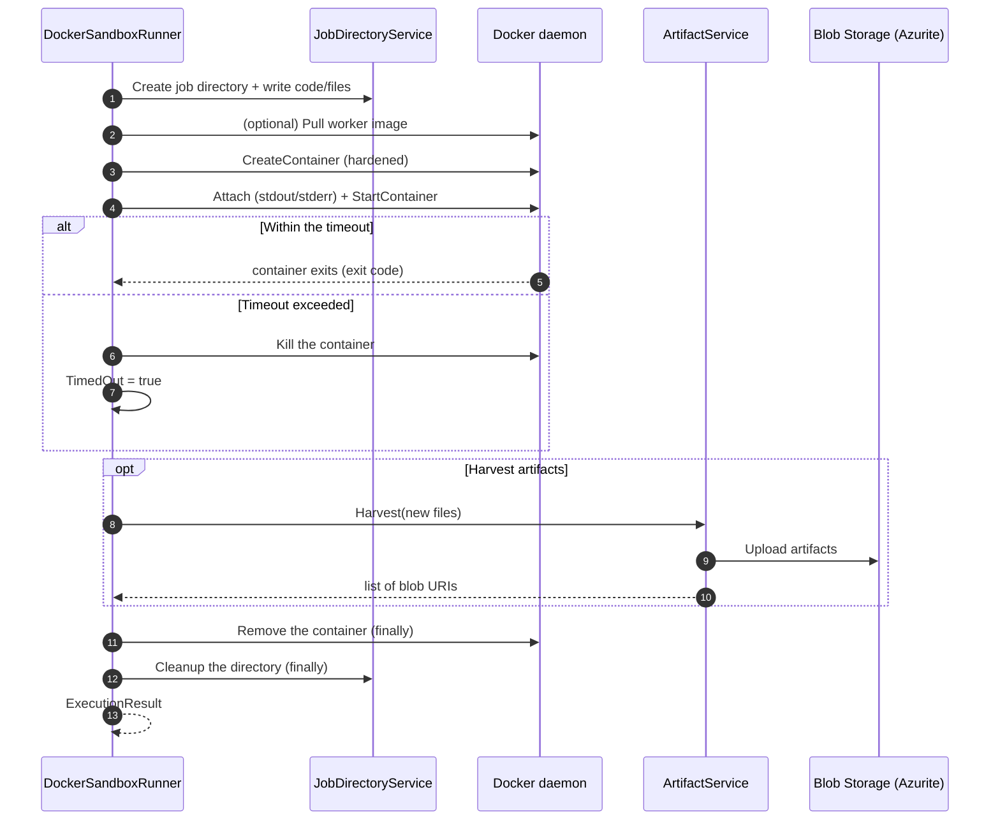

```mermaid
sequenceDiagram
    autonumber
    participant DR as DockerSandboxRunner
    participant JD as JobDirectoryService
    participant DK as Docker daemon
    participant AS as ArtifactService
    participant BL as Blob Storage (Azurite)

    DR->>JD: Create job directory + write code/files
    DR->>DK: (optional) Pull worker image
    DR->>DK: CreateContainer (hardened)
    DR->>DK: Attach (stdout/stderr) + StartContainer
    alt Within the timeout
        DK-->>DR: container exits (exit code)
    else Timeout exceeded
        DR->>DK: Kill the container
        DR->>DR: TimedOut = true
    end
    opt Harvest artifacts
        DR->>AS: Harvest(new files)
        AS->>BL: Upload artifacts
        AS-->>DR: list of blob URIs
    end
    DR->>DK: Remove the container (finally)
    DR->>JD: Cleanup the directory (finally)
    DR-->>DR: ExecutionResult
```
