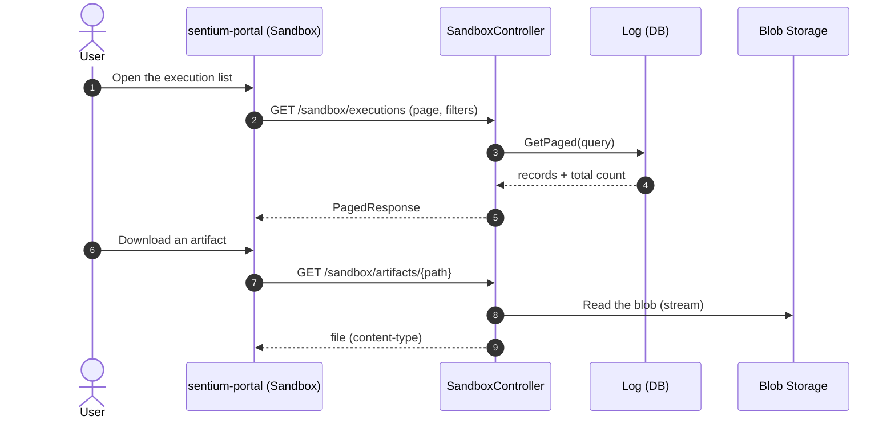

```mermaid
sequenceDiagram
    autonumber
    actor U as User
    participant FE as sentium-portal (Sandbox)
    participant SC as SandboxController
    participant LOG as Log (DB)
    participant BL as Blob Storage

    U->>FE: Open the execution list
    FE->>SC: GET /sandbox/executions (page, filters)
    SC->>LOG: GetPaged(query)
    LOG-->>SC: records + total count
    SC-->>FE: PagedResponse
    U->>FE: Download an artifact
    FE->>SC: GET /sandbox/artifacts/{path}
    SC->>BL: Read the blob (stream)
    SC-->>FE: file (content-type)
```
