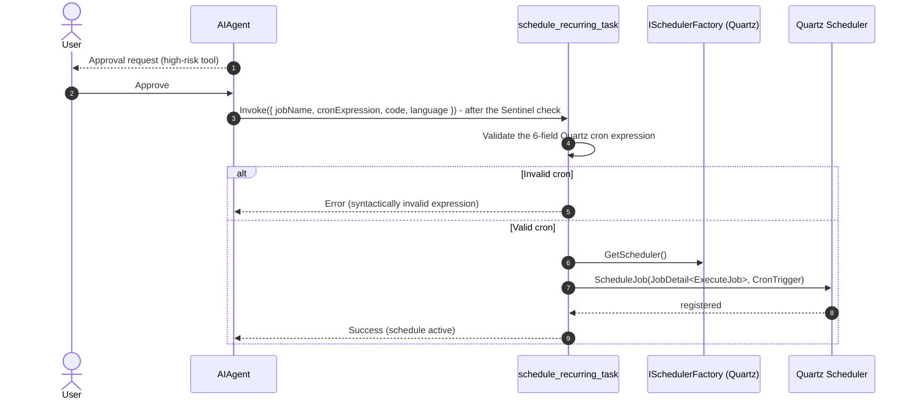

```mermaid
sequenceDiagram
    autonumber
    actor U as User
    participant AG as AIAgent
    participant ST as schedule_recurring_task
    participant SF as ISchedulerFactory (Quartz)
    participant SCH as Quartz Scheduler

    AG-->>U: Approval request (high-risk tool)
    U->>AG: Approve
    AG->>ST: Invoke({ jobName, cronExpression, code, language }) - after the Sentinel check
    ST->>ST: Validate the 6-field Quartz cron expression
    alt Invalid cron
        ST-->>AG: Error (syntactically invalid expression)
    else Valid cron
        ST->>SF: GetScheduler()
        ST->>SCH: ScheduleJob(JobDetail<ExecuteJob>, CronTrigger)
        SCH-->>ST: registered
        ST-->>AG: Success (schedule active)
    end
```
