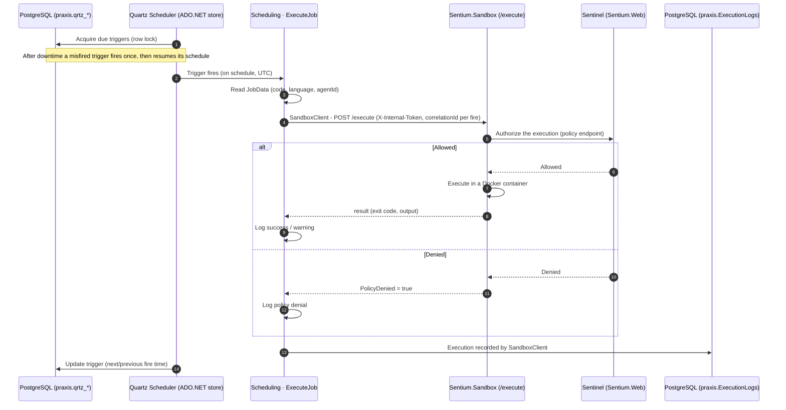

```mermaid
sequenceDiagram
    autonumber
    participant DB as PostgreSQL (praxis.qrtz_*)
    participant SCH as Quartz Scheduler (ADO.NET store)
    participant EJ as Scheduling · ExecuteJob
    participant SB as Sentium.Sandbox (/execute)
    participant SE as Sentinel (Sentium.Web)
    participant LOG as PostgreSQL (praxis.ExecutionLogs)

    SCH->>DB: Acquire due triggers (row lock)
    Note over SCH,DB: After downtime a misfired trigger fires once, then resumes its schedule
    SCH->>EJ: Trigger fires (on schedule, UTC)
    EJ->>EJ: Read JobData (code, language, agentId)
    EJ->>SB: SandboxClient - POST /execute (X-Internal-Token, correlationId per fire)
    SB->>SE: Authorize the execution (policy endpoint)
    alt Allowed
        SE-->>SB: Allowed
        SB->>SB: Execute in a Docker container
        SB-->>EJ: result (exit code, output)
        EJ->>EJ: Log success / warning
    else Denied
        SE-->>SB: Denied
        SB-->>EJ: PolicyDenied = true
        EJ->>EJ: Log policy denial
    end
    EJ->>LOG: Execution recorded by SandboxClient
    SCH->>DB: Update trigger (next/previous fire time)
```
