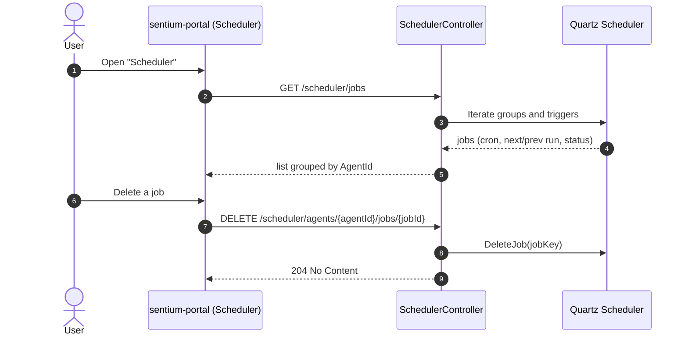

```mermaid
sequenceDiagram
    autonumber
    actor U as User
    participant FE as sentium-portal (Scheduler)
    participant SC as SchedulerController
    participant SCH as Quartz Scheduler

    U->>FE: Open "Scheduler"
    FE->>SC: GET /scheduler/jobs
    SC->>SCH: Iterate groups and triggers
    SCH-->>SC: jobs (cron, next/prev run, status)
    SC-->>FE: list grouped by AgentId
    U->>FE: Delete a job
    FE->>SC: DELETE /scheduler/agents/{agentId}/jobs/{jobId}
    SC->>SCH: DeleteJob(jobKey)
    SC-->>FE: 204 No Content
```
