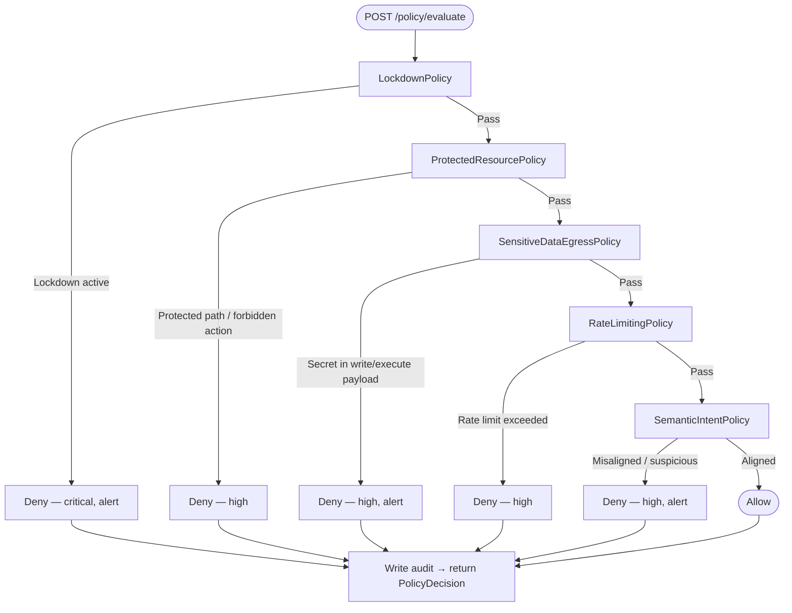

```mermaid
flowchart TD
    REQ([POST /policy/evaluate]) --> LD[LockdownPolicy]
    LD -->|Lockdown active| D1[Deny — critical, alert]
    LD -->|Pass| PR[ProtectedResourcePolicy]
    PR -->|Protected path / forbidden action| D2[Deny — high]
    PR -->|Pass| SE[SensitiveDataEgressPolicy]
    SE -->|Secret in write/execute payload| D3[Deny — high, alert]
    SE -->|Pass| RL[RateLimitingPolicy]
    RL -->|Rate limit exceeded| D4[Deny — high]
    RL -->|Pass| SI[SemanticIntentPolicy]
    SI -->|Misaligned / suspicious| D5[Deny — high, alert]
    SI -->|Aligned| ALLOW([Allow])
    D1 & D2 & D3 & D4 & D5 --> AUDIT[Write audit → return PolicyDecision]
    ALLOW --> AUDIT
```
