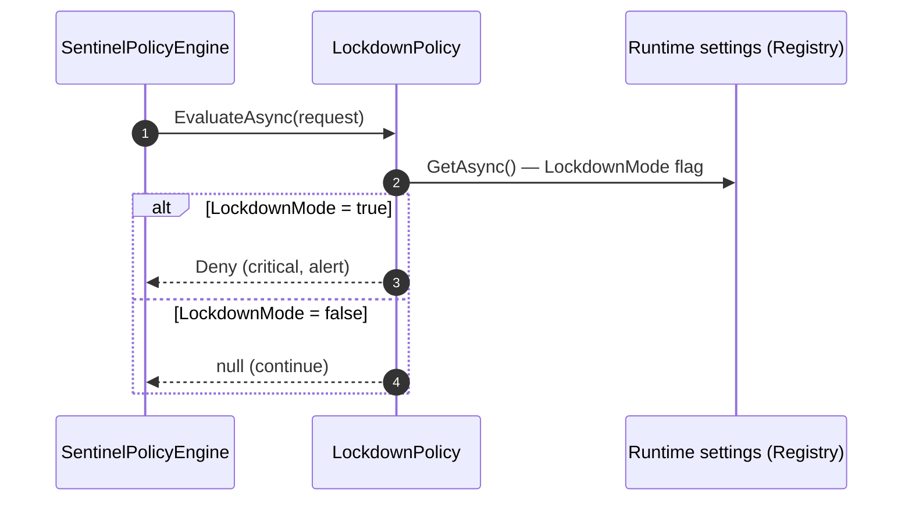

```mermaid
sequenceDiagram
    autonumber
    participant EN as SentinelPolicyEngine
    participant LD as LockdownPolicy
    participant RS as Runtime settings (Registry)

    EN->>LD: EvaluateAsync(request)
    LD->>RS: GetAsync() — LockdownMode flag
    alt LockdownMode = true
        LD-->>EN: Deny (critical, alert)
    else LockdownMode = false
        LD-->>EN: null (continue)
    end
```
