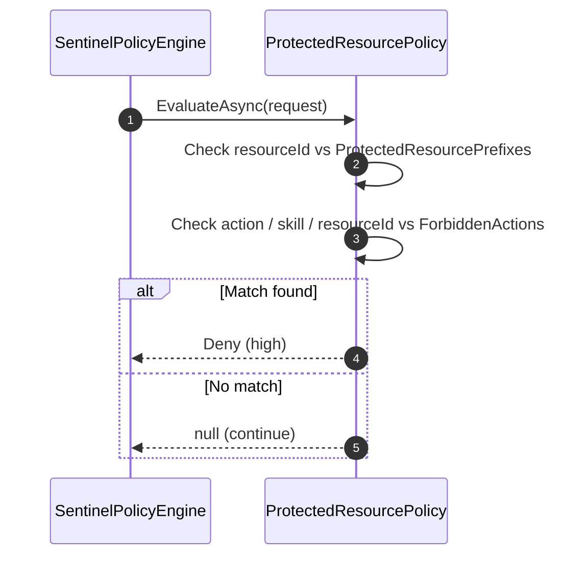

```mermaid
sequenceDiagram
    autonumber
    participant EN as SentinelPolicyEngine
    participant PR as ProtectedResourcePolicy

    EN->>PR: EvaluateAsync(request)
    PR->>PR: Check resourceId vs ProtectedResourcePrefixes
    PR->>PR: Check action / skill / resourceId vs ForbiddenActions
    alt Match found
        PR-->>EN: Deny (high)
    else No match
        PR-->>EN: null (continue)
    end
```
